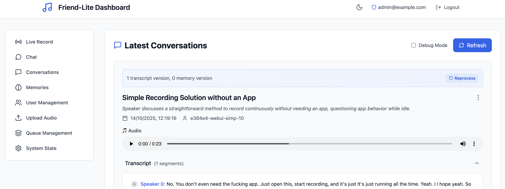
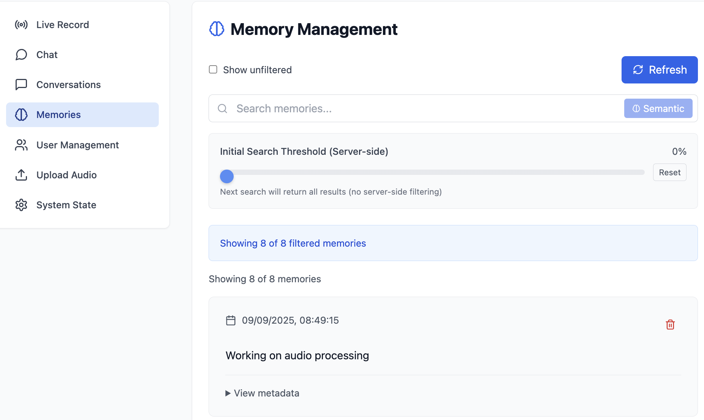

# Friend-Lite

Self-hostable AI system that captures audio/video data from OMI devices and other sources to generate memories, action items, and contextual insights about your conversations and daily interactions.

## Quick Start → [Get Started](quickstart.md)

Clone, run setup wizard, start services, access at http://localhost:5173

## Screenshots

### WebUI Dashboard

### Memory Search

*[Mobile App - Screenshot coming soon]*

## What's Included

- **Mobile app** for OMI devices via Bluetooth
- **Backend services** (simple → advanced with full AI features)
- **Web dashboard** for conversation and memory management
- **Optional services**: Speaker recognition, offline ASR, distributed deployment

## Links

- **📚 [Setup Guide](quickstart.md)** - Start here
- **🔧 [Full Documentation](CLAUDE.md)** - Comprehensive reference
- **🏗️ [Architecture Details](Docs/features.md)** - Technical deep dive
- **🐳 [Docker/K8s](README-K8S.md)** - Container deployment

## Vision

This fits as a small part of the larger idea of "Have various sensors feeding the state of YOUR world to computers/AI and get some use out of it"

Usecases are numerous - OMI Mentor is one of them. Friend/Omi/pendants are a small but important part of this, since they record personal spoken context the best. OMI-like devices with a camera can also capture visual context - or smart glasses - which also double as a display.

Regardless - this repo will try to do the minimal of this - multiple OMI-like audio devices feeding audio data - and from it:
- Memories
- Action items  
- Home automation

## Golden Goals (Not Yet Achieved)

- **Action items detection** (partial implementation)
- **Home automation integration** (planned)
- **Multi-device coordination** (planned)
- **Visual context capture** (smart glasses integration planned)

