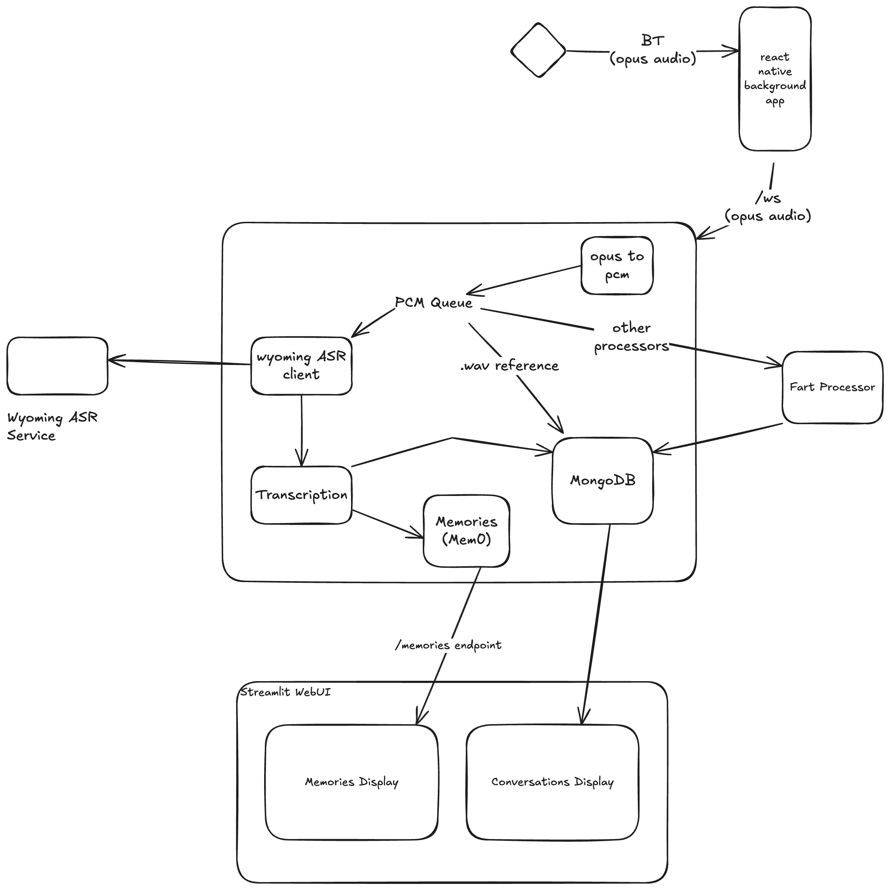

# Own your Friend DevKit, DevKit 2, OMI 

# Intro
The idea of this repo is to provide just enough to be useful for developers.
It should provide the minimal requirements to either:
1. Provide firmware, sdks, examples to make your own software
2. Advanced solution or tutorial for one such that you can get full use of your devices.

Instead of going the way of making OMI's ecosystem compatible and more open - 
This will attempt to make it easy to roll your own - and then try to make it compatible with OMI's ecosystem.

The app uses react native sdk (A fork of it, since the original wasn't updated fast enough)
The backend uses the python sdk (A fork of it, since the original isn't pushed to pypi)

# Vision
This fits as a small part of the larger idea of 
"Have various sensors feeding the state of YOUR world to computers/AI and get some use out of it"

Usecases are numerous - OMI Mentor is one of them
Friend/Omi/pendants are a small but important part of this, since they record personal spoken context the best.
OMI-like devices with a camera can also capture visual context - or smart glasses - which also double as a display.  

Regardless - this repo will try to do the minimal of this - multiple OMI-like audio devices feeding audio data - and from it,
- Memories
- Action items
- Home automation

# Arch

## Arch description
The current DevKit2 streams audio via Bluetooth to some device in the OPUS codec.
Once you have audio, you need trascription (you need speech to text AKA STT or automatic speech recognition AKA ASR. Deepgram is an API based service where you stream your audio to them and they give you transcripts. You can host this locally) from it and then any other things you want, such as -
Conversation summarization (typically done via LLMs, so ollama or call OpenAI)
You also need to store these things somewhere - and you need to store different things - 
1. Transcript
2. Conversation summary
3. Maybe the audio itself?
4. Memories

Memories are stored in qdrant
Conversation, and like, general logging is done on mongodb. 

Its a little complicated to turn that into PCM, which most Apps use.

# Wyoming protocol compatible ASR services under extras/asr-services

# Backends are standardized to use wyoming protocol too.