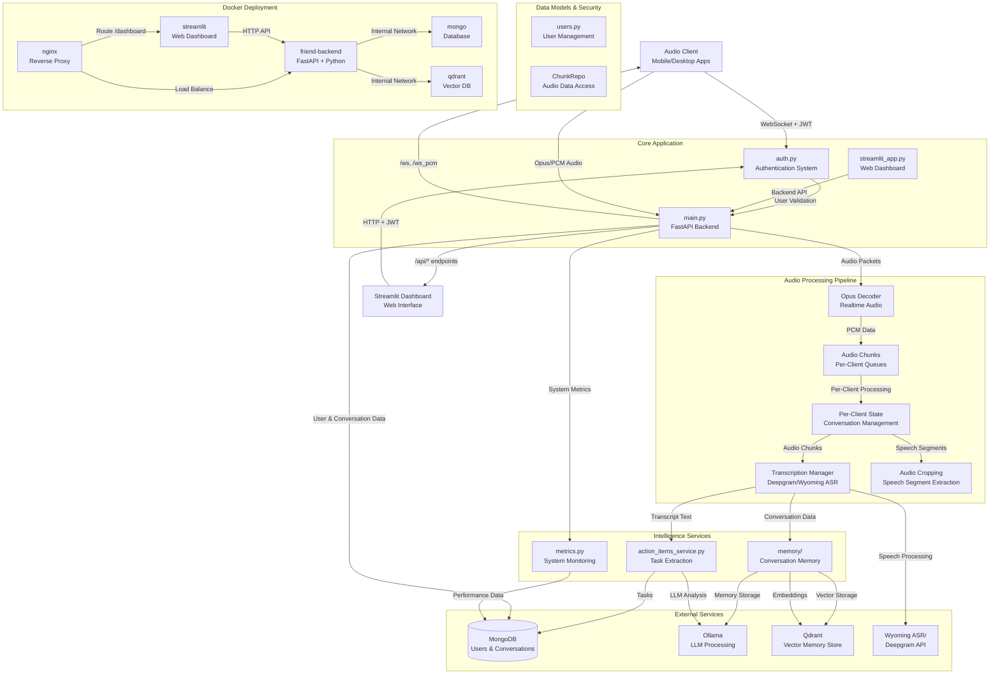
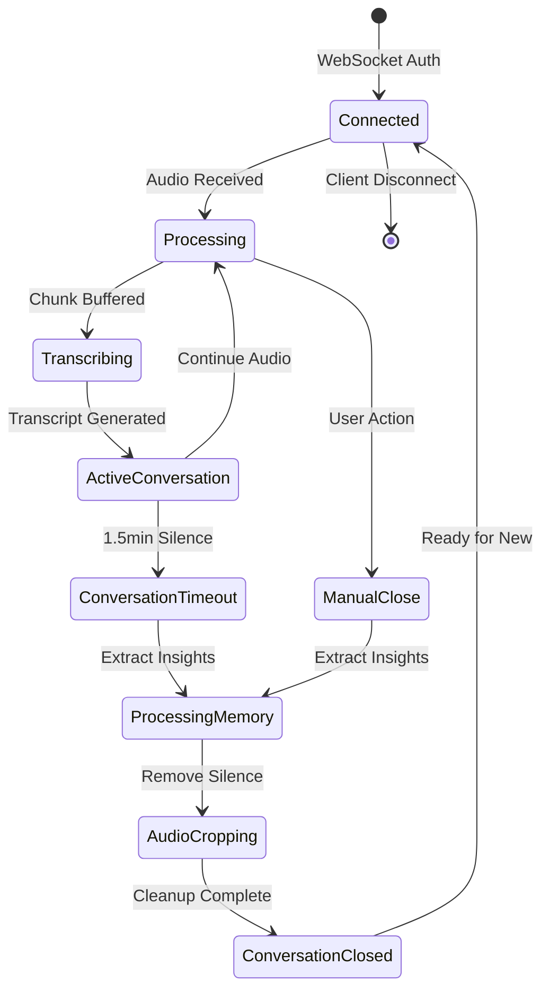
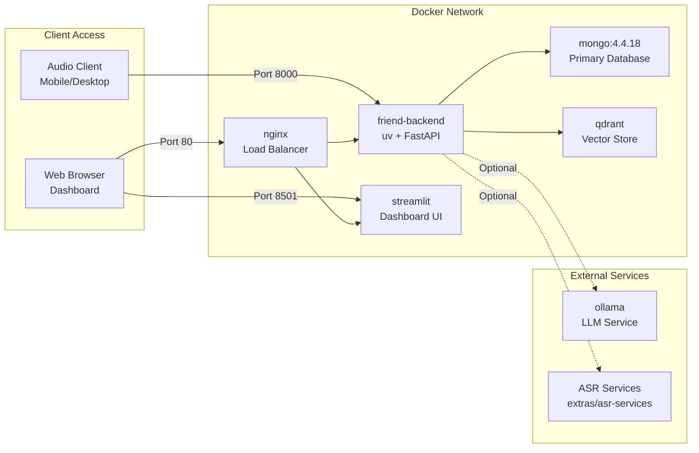

# Friend-Lite Backend Architecture

> 📖 **Prerequisite**: Read [quickstart.md](./quickstart.md) first for basic system understanding.

## System Overview

Friend-Lite is a comprehensive real-time conversation processing system that captures audio streams, performs speech-to-text transcription, extracts memories, and generates action items. The system features a FastAPI backend with WebSocket audio streaming, a Streamlit web dashboard for management, and complete user authentication with role-based access control.

**Core Implementation**: The complete system is implemented in `src/main.py` with supporting services in dedicated modules.

## Architecture Diagram



## Component Descriptions

### Core Application

#### FastAPI Backend (`main.py`)
- **Authentication-First Design**: All endpoints require JWT authentication
- **WebSocket Audio Streaming**: Real-time Opus/PCM audio ingestion with per-client isolation (`main.py:1562+`)
- **Conversation Management**: Automatic conversation lifecycle with timeout handling (`main.py:1018-1149`)
- **REST API Suite**: Comprehensive endpoints for user, conversation, memory, and action item management (`main.py:1700+`)
- **Health Monitoring**: Detailed service health checks and performance metrics (`main.py:2500+`)
- **Audio Cropping**: Intelligent speech segment extraction using FFmpeg (`main.py:174-200`)

#### Authentication System (`auth.py`)
- **FastAPI-Users Integration**: Complete user lifecycle management
- **Email Authentication**: User authentication via email and password
- **Multi-Authentication**: JWT tokens,  and cookie-based sessions
- **Role-Based Access Control**: Admin vs regular user permissions with data isolation
- **WebSocket Security**: Custom authentication for real-time connections with token/cookie support
- **Admin User Bootstrap**: Automatic admin account creation
- **Client ID Generation**: Automatic `objectid_suffix-device_name` format for client identification

#### Streamlit Dashboard (`streamlit_app.py`)
- **User-Friendly Interface**: Complete web-based management interface
- **Authentication Integration**: Login with backend JWT tokens or Google OAuth
- **Real-Time Monitoring**: Live client status and conversation management
- **Data Management**: User, conversation, memory, and action item interfaces
- **Audio Playback**: Smart audio player with original/cropped audio options
- **System Health**: Visual service status and configuration display

### Audio Processing Pipeline

#### Per-Client State Management


#### Audio Processing Queues (Per-Client)
- **Chunk Queue**: Raw audio buffering with client isolation
- **Transcription Queue**: Audio chunks for real-time ASR processing
- **Memory Queue**: Completed conversations for LLM memory extraction
- **Action Item Queue**: Transcript analysis for task detection

#### Speech Processing Features
- **Voice Activity Detection**: Automatic silence removal and speech segment extraction
- **Audio Cropping**: FFmpeg-based processing to create concise audio files
- **Multiple Format Support**: Opus (compressed) and PCM (uncompressed) audio input
- **Conversation Chunking**: 60-second segments with seamless processing

### Intelligence Services

#### Action Items Service (`action_items_service.py`)
- **User-Centric Storage**: Action items stored with database user_id (not client_id)
- **LLM-Powered Extraction**: Uses Ollama for intelligent task identification
- **Trigger Recognition**: Special "Simon says" keyphrase detection for explicit task creation
- **Task Management**: Full CRUD operations with status tracking (open, in-progress, completed, cancelled)
- **Client Metadata**: Client and user information stored for reference and debugging
- **Context Preservation**: Links action items to original conversations and audio segments

#### Memory Management (`src/memory/memory_service.py`)
- **User-Centric Storage**: All memories keyed by database user_id (not client_id)
- **Conversation Summarization**: Automatic memory extraction using mem0 framework
- **Vector Storage**: Semantic memory search with Qdrant embeddings
- **Client Metadata**: Client information stored in memory metadata for reference
- **User Isolation**: Complete data separation between users via user_id
- **Temporal Memory**: Long-term conversation history with semantic retrieval
- **Processing Trigger**: `main.py:1047-1065` (conversation end) → `main.py:1163-1195` (background processing)

#### Metrics System (`metrics.py`)
- **Performance Tracking**: Audio processing latency, transcription success rates
- **Service Health Monitoring**: External service connectivity and response times
- **User Analytics**: Connection patterns, conversation statistics
- **Resource Monitoring**: System resource usage and bottleneck identification

### Data Models & Access

#### User Management (`users.py`)
- **Beanie ODM**: MongoDB document modeling with type safety
- **User ID System**: MongoDB ObjectId-based user identification
- **Authentication Data**: Secure password hashing, email verification, email-based login
- **Profile Management**: User preferences, display names, and permissions
- **Client Registration**: Tracking of registered clients per user with device names
- **Data Ownership**: All data (conversations, memories, action items) associated via user_id
- **Client ID Generation**: Helper functions for `objectid_suffix-device_name` format

#### Conversation Data Access (`ChunkRepo`)
- **Audio Metadata**: File paths, timestamps, duration tracking
- **Transcript Management**: Speaker identification and timing information
- **Memory Links**: Connection between conversations and extracted memories
- **Action Item Relations**: Task tracking per conversation

#### Permission System
- **Dictionary-Based Mapping**: Clean client-user relationship tracking via in-memory dictionaries
- **Active Client Tracking**: `client_to_user_mapping` for currently connected clients
- **Persistent Tracking**: `all_client_user_mappings` for database query permission checks
- **Ownership Validation**: Simple dictionary lookup instead of regex pattern matching
- **Data Isolation**: User-scoped queries using client ID lists for efficient permission filtering

## Deployment Architecture

### Docker Compose Structure



### Container Specifications

#### Backend Container (`friend-backend`)
- **Base**: Python 3.12 slim with uv package manager
- **Dependencies**: FastAPI, WebSocket libraries, audio processing tools
- **Volumes**: Audio chunk storage, debug directories
- **Health Checks**: Automated readiness and liveness probes
- **Environment**: All configuration via environment variables

#### Streamlit Container (`streamlit`)
- **Purpose**: Web dashboard interface
- **Dependencies**: Streamlit, requests, pandas for data visualization
- **Backend Integration**: HTTP API client with authentication
- **Configuration**: Backend URL configuration for API calls

#### Infrastructure Containers
- **MongoDB 4.4.18**: Primary data storage with persistence
- **Qdrant Latest**: Vector database for memory embeddings
- **Nginx Alpine**: Reverse proxy and load balancing

## Data Flow Architecture

### Audio Ingestion & Processing
1. **Client Authentication**: JWT token validation for WebSocket connection (email or user_id based)
2. **Client ID Generation**: Automatic `user_id-device_name` format creation for client identification
3. **Permission Registration**: Client-user relationship tracking in permission dictionaries
4. **Audio Streaming**: Real-time Opus/PCM packets over WebSocket with user context
5. **Per-Client Processing**: Isolated audio queues and state management per user
6. **Transcription Pipeline**: Configurable ASR service integration with user-scoped storage
7. **Conversation Lifecycle**: Automatic timeout handling and memory processing
8. **Audio Optimization**: Speech segment extraction and silence removal

### Memory & Intelligence Processing
1. **Conversation Completion**: End-of-session trigger for memory extraction
2. **User Resolution**: Client-ID to database user mapping for proper data association
3. **LLM Processing**: Ollama-based conversation summarization with user context
4. **Vector Storage**: Semantic embeddings stored in Qdrant keyed by user_id
5. **Action Item Analysis**: Automatic task detection with user-centric storage
6. **Metadata Enhancement**: Client information and user email stored in metadata
7. **Search & Retrieval**: User-scoped semantic memory search capabilities

### User Management & Security
1. **Registration**: Admin-controlled user creation with email/password and auto-generated user_id
2. **Dual Authentication**: JWT token generation for both email and user_id login methods
3. **Client Association**: Automatic client ID generation as `user_id-device_name`
4. **Permission Tracking**: Dictionary-based client-user relationship management
5. **Authorization**: Per-endpoint permission checking with simplified ownership validation
6. **Data Isolation**: User-scoped data access via client ID mapping and ownership validation

## Security Architecture

### Authentication Layers
- **API Gateway**: JWT middleware on all protected endpoints with email/user_id support
- **WebSocket Security**: Custom authentication handler for real-time connections (token + cookie support)
- **Client ID Management**: Automatic generation and validation of `user_id-device_name` format
- **Permission Mapping**: Dictionary-based client-user relationship tracking
- **Role Validation**: Admin vs user permission matrix enforcement
- **Data Scoping**: Efficient user context filtering via client ID mapping

### Access Control Matrix
| Resource | Regular User | Superuser |
|----------|-------------|-----------|
| Own Conversations | Full Access | Full Access |
| Other Users' Conversations | No Access | Full Access |
| User Management | Profile Only | Full CRUD |
| System Administration | Health Check Only | Full Access |
| Active Client Management | Own Clients Only | All Clients |
| Memory Management | Own Memories Only | All Memories (with client info) |
| Action Items | Own Items Only | All Items (with client info) |

### Data Protection
- **Encryption**: JWT token signing with configurable secret keys
- **Password Security**: Bcrypt hashing with salt rounds
- **User Identification**: MongoDB ObjectId-based user system
- **Data Isolation**: User ID validation on all data operations via client mapping
- **Permission Efficiency**: Dictionary-based ownership checking instead of regex patterns
- **Audit Logging**: Comprehensive request and authentication logging with user_id tracking

## Configuration & Environment

### Required Environment Variables
```bash
AUTH_SECRET_KEY=your-super-secret-jwt-key-here-make-it-long-and-random
ADMIN_PASSWORD=your-secure-admin-password
```

### Optional Service Configuration
```bash
# Database
MONGODB_URI=mongodb://mongo:27017

# LLM Processing
OLLAMA_BASE_URL=http://ollama:11434

# Vector Storage
QDRANT_BASE_URL=qdrant

# ASR Services
DEEPGRAM_API_KEY=your-deepgram-api-key
OFFLINE_ASR_TCP_URI=tcp://host.docker.internal:8765

# OAuth Integration
GOOGLE_CLIENT_ID=your-google-client-id
GOOGLE_CLIENT_SECRET=your-google-client-secret
```

### Service Dependencies

#### Critical Services (Required for Core Functionality)
- **MongoDB**: User data, conversations, action items
- **Authentication**: JWT token validation and user sessions

#### Enhanced Services (Optional but Recommended)
- **Ollama**: Memory processing and action item extraction
- **Qdrant**: Vector storage for semantic memory search
- **ASR Service**: Speech-to-text transcription (Deepgram or self-hosted)

#### External Services (Optional)
- **Google OAuth**: Simplified user authentication
- **Ngrok**: Public internet access for development
- **HAVPE Relay**: ESP32 audio streaming bridge with authentication (`extras/havpe-relay/`)

### HAVPE Relay Integration
The HAVPE relay (`extras/havpe-relay/main.py`) provides ESP32 audio streaming capabilities:

- **Authentication**: Supports both `AUTH_EMAIL` and `AUTH_USER_ID` environment variables
- **Client ID Generation**: Creates client ID as `user_id-havpe` automatically
- **Audio Processing**: Converts ESP32 32-bit stereo to 16-bit mono for backend
- **Reconnection**: Automatic JWT token refresh and WebSocket reconnection on auth failures
- **Device Name**: Configurable device identifier for multi-device support

## Performance & Scalability

### Client Isolation Design
- **Per-Client Queues**: Independent processing pipelines prevent cross-client interference
- **Async Processing**: Non-blocking audio ingestion with background processing
- **Resource Management**: Configurable timeouts and cleanup procedures
- **State Management**: Memory-efficient client state with automatic cleanup

### Monitoring & Observability
- **Health Checks**: Comprehensive service dependency validation
- **Performance Metrics**: Audio processing latency, transcription accuracy
- **Resource Tracking**: Memory usage, connection counts, processing queues
- **Error Handling**: Graceful degradation with detailed logging

This architecture supports a fully-featured conversation processing system with enterprise-grade authentication, real-time audio processing, and intelligent content analysis, all deployable via a single Docker Compose command. 