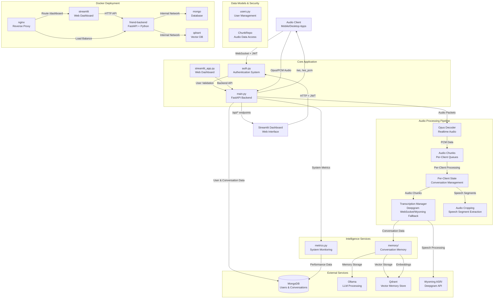
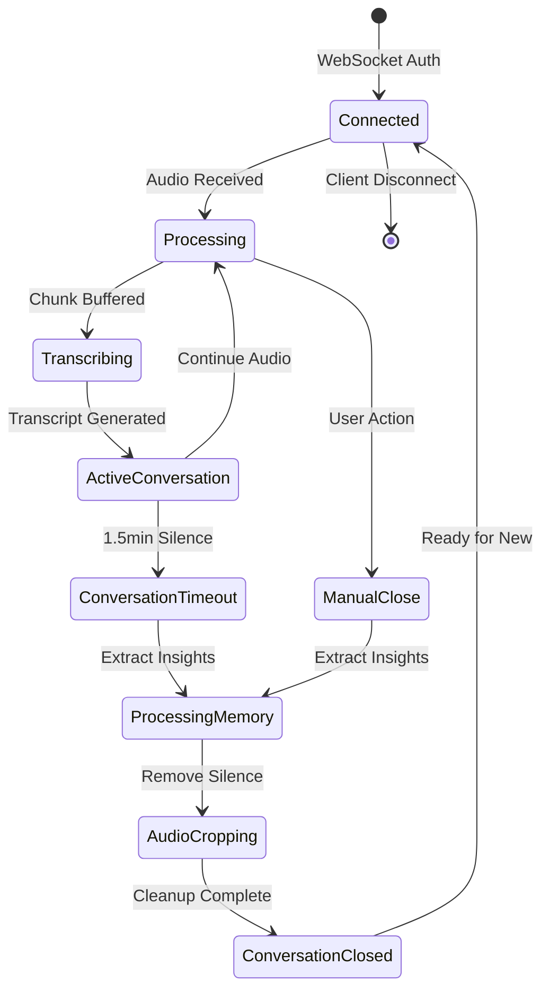
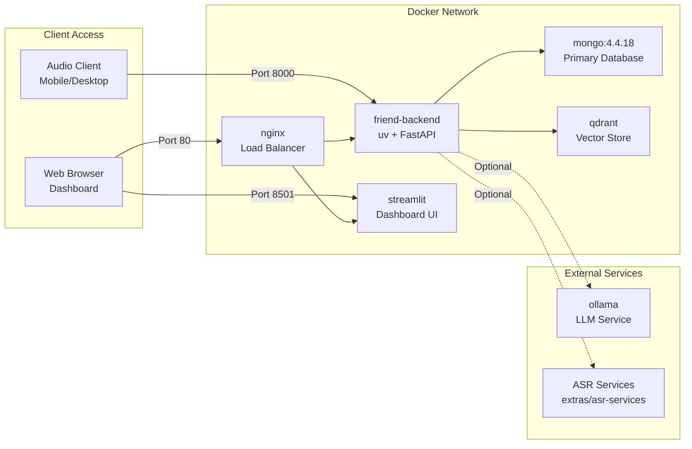

# Friend-Lite Backend Architecture

> 📖 **Prerequisite**: Read [quickstart.md](./quickstart.md) first for basic system understanding.

## System Overview

Friend-Lite is a comprehensive real-time conversation processing system that captures audio streams, performs speech-to-text transcription, and extracts memories. The system features a FastAPI backend with WebSocket audio streaming, a Streamlit web dashboard for management, and complete user authentication with role-based access control.

**Core Implementation**: The complete system is implemented in `src/main.py` with supporting services in dedicated modules.

## Architecture Diagram



## Component Descriptions

### Core Application

#### FastAPI Backend (`main.py`)
- **Authentication-First Design**: All endpoints require JWT authentication
- **WebSocket Audio Streaming**: Real-time Opus/PCM audio ingestion with per-client isolation (`main.py:1562+`)
- **Conversation Management**: Automatic conversation lifecycle with timeout handling (`main.py:1018-1149`)
- **REST API Suite**: Comprehensive endpoints for user, conversation, and memory management (`main.py:1700+`)
- **Health Monitoring**: Detailed service health checks and performance metrics (`main.py:2500+`)
- **Audio Cropping**: Intelligent speech segment extraction using FFmpeg (`main.py:174-200`)

#### Authentication System (`auth.py`)
- **FastAPI-Users Integration**: Complete user lifecycle management
- **Email Authentication**: User authentication via email and password
- **Multi-Authentication**: JWT tokens,  and cookie-based sessions
- **Role-Based Access Control**: Admin vs regular user permissions with data isolation
- **WebSocket Security**: Custom authentication for real-time connections with token/cookie support
- **Admin User Bootstrap**: Automatic admin account creation
- **Client ID Generation**: Automatic `objectid_suffix-device_name` format for client identification

> 📖 **Read more**: [Authentication Architecture](./auth.md) for complete authentication system details

#### Streamlit Dashboard (`streamlit_app.py`)
- **User-Friendly Interface**: Complete web-based management interface
- **Authentication Integration**: Login with backend JWT tokens or Google OAuth
- **Real-Time Monitoring**: Live client status and conversation management
- **Data Management**: User, conversation, and memory interfaces
- **Audio Playback**: Smart audio player with original/cropped audio options
- **System Health**: Visual service status and configuration display

### Audio Processing Pipeline

#### Transcription Architecture

The system implements a dual transcription approach with Deepgram as primary and Wyoming ASR as fallback:

**Deepgram Batch Processing**:
- **Model**: Nova-3 (Deepgram's latest high-accuracy model)
- **Features**: Smart formatting, punctuation, speaker diarization
- **Processing**: Collect-then-process approach using REST API
- **Timeout**: 1.5 minute collection timeout for optimal quality
- **Client Manager Integration**: Uses centralized ClientManager for clean client state access
- **Configuration**: Auto-enables when `DEEPGRAM_API_KEY` environment variable is present

**Wyoming ASR Fallback**:
- **Purpose**: Offline fallback when Deepgram unavailable
- **Protocol**: TCP connection to self-hosted Wyoming ASR service
- **Event-Driven**: Asynchronous event processing with background queue management
- **Graceful Degradation**: Seamless fallback without service interruption

**TranscriptionManager Architecture**:
```python
# Clean dependency injection pattern
TranscriptionManager(
    chunk_repo=database_repo,
    # Uses get_client_manager() singleton for client state access
)
```

#### Client Manager Architecture

The system uses a centralized **ClientManager** for managing active client connections and state:

**Centralized Client Management**:
```python
# Singleton pattern for global client state access
client_manager = get_client_manager()

# Client state management
client_state = ClientState(
    client_id="user_id_suffix-device_name",
    chunk_repo=database_repo,
    chunk_dir=audio_storage_path
)
```

**Client ID Format**: `{objectid_suffix}-{device_name}`
- Uses last 6 characters of MongoDB ObjectId + device name
- Examples: `cd7994-laptop`, `e26efe-upload-001`
- Ensures unique identification across users and devices

**Key Features**:
- **Connection Tracking**: Real-time monitoring of active clients
- **State Isolation**: Per-client queues and processing pipelines
- **Resource Management**: Automatic cleanup on client disconnect
- **Multi-Device Support**: Single user can have multiple active clients
- **Thread-Safe Operations**: Concurrent client access with proper synchronization

#### Per-Client State Management


#### Audio Processing Queues (Per-Client)
- **Chunk Queue**: Raw audio buffering with client isolation
- **Transcription Queue**: Audio chunks for real-time ASR processing with quality validation
- **Memory Queue**: Completed conversations for LLM memory extraction (with transcript validation)
- **Quality Control**: Multi-stage validation prevents empty/invalid transcripts from consuming LLM resources

#### Speech Processing Features
- **Voice Activity Detection**: Automatic silence removal and speech segment extraction
- **Audio Cropping**: FFmpeg-based processing to create concise audio files
- **Multiple Format Support**: Opus (compressed) and PCM (uncompressed) audio input
- **Conversation Chunking**: 60-second segments with seamless processing

### Intelligence Services


#### Memory Management (`src/memory/memory_service.py`)
- **User-Centric Storage**: All memories keyed by database user_id (not client_id)
- **Conversation Summarization**: Automatic memory extraction using mem0 framework
- **Vector Storage**: Semantic memory search with Qdrant embeddings
- **Client Metadata**: Client information stored in memory metadata for reference
- **User Isolation**: Complete data separation between users via user_id
- **Temporal Memory**: Long-term conversation history with semantic retrieval
- **Processing Trigger**: `main.py:1047-1065` (conversation end) → `main.py:1163-1195` (background processing)

> 📖 **Read more**: [Memory System Documentation](./memories.md) for detailed memory extraction and storage

#### Metrics System (`metrics.py`)
- **Performance Tracking**: Audio processing latency, transcription success rates
- **Service Health Monitoring**: External service connectivity and response times
- **User Analytics**: Connection patterns, conversation statistics
- **Resource Monitoring**: System resource usage and bottleneck identification

### Data Models & Access

#### User Management (`users.py`)
- **Beanie ODM**: MongoDB document modeling with type safety
- **User ID System**: MongoDB ObjectId-based user identification
- **Authentication Data**: Secure password hashing, email verification, email-based login
- **Profile Management**: User preferences, display names, and permissions
- **Client Registration**: Tracking of registered clients per user with device names
- **Data Ownership**: All data (conversations, memories) associated via user_id
- **Client ID Generation**: Helper functions for `objectid_suffix-device_name` format

#### Conversation Data Access (`ChunkRepo`)
- **Audio Metadata**: File paths, timestamps, duration tracking
- **Transcript Management**: Speaker identification and timing information
- **Memory Links**: Connection between conversations and extracted memories

#### Permission System
- **Dictionary-Based Mapping**: Clean client-user relationship tracking via in-memory dictionaries
- **Active Client Tracking**: `client_to_user_mapping` for currently connected clients
- **Persistent Tracking**: `all_client_user_mappings` for database query permission checks
- **Ownership Validation**: Simple dictionary lookup instead of regex pattern matching
- **Data Isolation**: User-scoped queries using client ID lists for efficient permission filtering

## Deployment Architecture

### Docker Compose Structure



### Container Specifications

#### Backend Container (`friend-backend`)
- **Base**: Python 3.12 slim with uv package manager
- **Dependencies**: FastAPI, WebSocket libraries, audio processing tools
- **Volumes**: Audio chunk storage, debug directories
- **Health Checks**: Automated readiness and liveness probes
- **Environment**: All configuration via environment variables

#### Streamlit Container (`streamlit`)
- **Purpose**: Web dashboard interface
- **Dependencies**: Streamlit, requests, pandas for data visualization
- **Backend Integration**: HTTP API client with authentication
- **Configuration**: Backend URL configuration for API calls

#### Infrastructure Containers
- **MongoDB 4.4.18**: Primary data storage with persistence
- **Qdrant Latest**: Vector database for memory embeddings
- **Neo4j 5.15**: Graph database for memory relationships and entity connections
- **Nginx Alpine**: Reverse proxy and load balancing

## Detailed Data Flow Architecture

> 📖 **Reference Documentation**: 
> - [Authentication Details](./auth.md) - Complete authentication system documentation

### Complete System Data Flow Diagram

```mermaid
flowchart TB
    %% External Clients
    Client[📱 Audio Client<br/>Mobile/Desktop/HAVPE]
    WebUI[🌐 Web Dashboard<br/>Streamlit Interface]

    %% Authentication Gateway
    subgraph "🔐 Authentication Layer"
        AuthGW[JWT/Cookie Auth<br/>🕐 1hr token lifetime]
        ClientGen[Client ID Generator<br/>user_suffix-device_name]
        UserDB[(👤 User Database<br/>MongoDB ObjectId)]
    end

    %% Audio Processing Pipeline
    subgraph "🎵 Audio Processing Pipeline"
        WSAuth[WebSocket Auth<br/>🕐 Connection timeout: 30s]
        OpusDecoder[Opus/PCM Decoder<br/>Real-time Processing]
        
        subgraph "⏱️ Per-Client State Management"
            ClientState[Client State<br/>🕐 Conversation timeout: 1.5min]
            AudioQueue[Audio Chunk Queue<br/>60s segments]
            ConversationTimer[Conversation Timer<br/>🔄 Auto-timeout tracking]
        end
        
        subgraph "🎙️ Transcription Layer"
            ASRManager[Transcription Manager<br/>🕐 Init timeout: 60s]
            DeepgramWS[Deepgram WebSocket<br/>Nova-3 Model, Smart Format<br/>🔌 Auto-reconnect on disconnect]
            OfflineASR[Wyoming ASR Fallback<br/>🕐 Connect timeout: 5s]
            ClientManager[Client Manager<br/>Centralized client state access]
            TranscriptValidation[Transcript Validation<br/>📏 Min 10 chars]
        end
    end

    %% Intelligence Services
    subgraph "🧠 Intelligence Processing"
        subgraph "💭 Memory Pipeline"
            MemoryService[Memory Service<br/>🕐 Init timeout: 60s<br/>🕐 Processing timeout: 20min]
            MemoryValidation[Memory Validation<br/>📏 Min conversation length]
            LLMProcessor[Ollama LLM<br/>🔄 Circuit breaker protection]
            VectorStore[Qdrant Vector Store<br/>🔍 Semantic search]
        end
        
    end

    %% Failure Recovery System
    subgraph "🛡️ Failure Recovery System"
        QueueTracker[Queue Tracker<br/>📊 SQLite tracking]
        PersistentQueue[Persistent Queue<br/>💾 Survives restarts]
        RecoveryManager[Recovery Manager<br/>🔄 Auto-retry with backoff]
        HealthMonitor[Health Monitor<br/>🏥 Service health checks]
        CircuitBreaker[Circuit Breaker<br/>⚡ Fast-fail protection]
        DeadLetter[Dead Letter Queue<br/>💀 Persistent failures]
    end

    %% Data Storage
    subgraph "💾 Data Storage Layer"
        MongoDB[(MongoDB<br/>Users & Conversations<br/>🕐 Health check: 5s)]
        QdrantDB[(Qdrant<br/>Vector Embeddings<br/>🔍 Semantic memory)]
        SQLiteTracking[(SQLite<br/>Failure Recovery Tracking<br/>📊 Performance metrics)]
        AudioFiles[Audio Files<br/>📁 Chunk storage + cropping]
    end

    %% Connection Flow with Timeouts
    Client -->|🔐 Auth Token| AuthGW
    AuthGW -->|❌ 401 Unauthorized<br/>⏱️ Invalid/expired token| Client
    AuthGW -->|✅ Validated| ClientGen
    ClientGen -->|🏷️ Generate client_id| WSAuth
    
    %% Audio Processing Flow
    Client -->|🎵 Opus/PCM Stream<br/>🕐 30s connection timeout| WSAuth
    WSAuth -->|❌ 1008 Policy Violation<br/>🔐 Auth required| Client
    WSAuth -->|✅ Authenticated| OpusDecoder
    OpusDecoder -->|📦 Audio chunks| ClientState
    ClientState -->|⏱️ 1.5min timeout check| ConversationTimer
    ConversationTimer -->|🔄 Timeout exceeded| ClientState
    
    %% Transcription Flow with Failure Points
    ClientState -->|🎵 Audio data| ASRManager
    ASRManager -->|🔌 Primary connection| DeepgramWS
    ASRManager -->|🔌 Fallback connection| OfflineASR
    ASRManager -->|📋 Client state access| ClientManager
    DeepgramWS -->|❌ WebSocket disconnect<br/>🔄 Auto-reconnect after 2s| ASRManager
    OfflineASR -->|❌ TCP connection timeout<br/>🕐 5s limit| ASRManager
    ASRManager -->|📝 Raw transcript| TranscriptValidation
    TranscriptValidation -->|❌ Too short (<10 chars)<br/>🚫 Skip processing| QueueTracker
    TranscriptValidation -->|✅ Valid transcript| MemoryService

    %% Memory Processing with Timeouts
    MemoryService -->|🕐 20min timeout| LLMProcessor
    LLMProcessor -->|❌ Model stopped<br/>🔄 Circuit breaker trip| CircuitBreaker
    LLMProcessor -->|❌ Empty response<br/>🔄 Fallback memory| MemoryService
    LLMProcessor -->|✅ Memory extracted| VectorStore
    MemoryService -->|📊 Track processing| QueueTracker
    

    %% Failure Recovery Integration
    QueueTracker -->|📊 Track all items| PersistentQueue
    PersistentQueue -->|🔄 Failed items| RecoveryManager
    RecoveryManager -->|🔄 Exponential backoff retry| MemoryService
    RecoveryManager -->|💀 Max retries exceeded| DeadLetter
    HealthMonitor -->|🏥 Service health checks<br/>🕐 5s MongoDB<br/>🕐 8s Ollama<br/>🕐 5s ASR| CircuitBreaker
    CircuitBreaker -->|⚡ Service unavailable<br/>🔄 Fast-fail mode| RecoveryManager

    %% Disconnect and Cleanup Flow
    Client -->|🔌 Disconnect| ClientState
    ClientState -->|🧹 Cleanup tasks<br/>🕐 Background memory: 5min<br/>🕐 Transcription queue: 60s| ASRManager
    ASRManager -->|🔌 Graceful disconnect<br/>🕐 2s timeout| DeepgramWS
    ClientState -->|🔄 Final conversation processing| MemoryService

    %% Storage Integration
    MemoryService -->|💾 Store memories| MongoDB
    VectorStore -->|💾 Embeddings| QdrantDB
    QueueTracker -->|📊 Metrics & tracking| SQLiteTracking
    ClientState -->|📁 Audio segments| AudioFiles

    %% Web Dashboard Flow
    WebUI -->|🔐 Cookie/JWT auth<br/>🕐 1hr lifetime| AuthGW
    WebUI -->|📊 API calls| MongoDB
    WebUI -->|🎵 Audio playback| AudioFiles
```

### Critical Timeout and Failure Points

#### 🕐 **Timeout Configuration**
| Component | Timeout Value | Failure Behavior | Recovery Action |
|-----------|---------------|------------------|-----------------|
| **JWT Tokens** | 1 hour | 401 Unauthorized | Client re-authentication required |
| **WebSocket Connection** | 30 seconds | Connection dropped | Client reconnection with auth |
| **Conversation Auto-Close** | 1.5 minutes | New conversation started | Memory processing triggered |
| **Transcription Queue** | 60 seconds | Queue processing timeout | Graceful degradation |
| **Memory Service Init** | 60 seconds | Service unavailable | Health check failure |
| **Ollama Processing** | 20 minutes | LLM timeout | Fallback memory creation |
| **Background Memory Task** | 5 minutes | Task cancellation | Partial processing retained |
| **MongoDB Health Check** | 5 seconds | Service marked unhealthy | Circuit breaker activation |
| **Ollama Health Check** | 8 seconds | Service marked unhealthy | Circuit breaker activation |
| **ASR Connection** | 5 seconds | Connection failure | Fallback ASR or degraded mode |

#### 🔌 **Disconnection Scenarios**
1. **Client Disconnect**: Graceful cleanup with conversation finalization
2. **Network Interruption**: Auto-reconnection with exponential backoff  
3. **Service Failure**: Circuit breaker protection and alternative routing
4. **Authentication Expiry**: Forced re-authentication with clear error codes


### Audio Ingestion & Processing
1. **Client Authentication**: JWT token validation for WebSocket connection (email or user_id based)
2. **Client ID Generation**: Automatic `user_id-device_name` format creation for client identification  
3. **Permission Registration**: Client-user relationship tracking in permission dictionaries
4. **Audio Streaming**: Real-time Opus/PCM packets over WebSocket with user context
5. **Per-Client Processing**: Isolated audio queues and state management per user
6. **Transcription Pipeline**: Configurable ASR service integration with user-scoped storage
7. **Conversation Lifecycle**: Automatic timeout handling and memory processing
8. **Audio Optimization**: Speech segment extraction and silence removal

### Memory & Intelligence Processing
1. **Conversation Completion**: End-of-session trigger for memory extraction
2. **Transcript Validation**: Multi-layer validation prevents empty/short transcripts from reaching LLM
   - Individual transcript filtering during collection (`main.py:594, 717, 858`)
   - Full conversation length validation before memory processing (`main.py:1224`)
   - Memory service validation with 10-character minimum (`memory_service.py:242`)
3. **User Resolution**: Client-ID to database user mapping for proper data association
4. **LLM Processing**: Ollama-based conversation summarization with user context (only for validated transcripts)
5. **Vector Storage**: Semantic embeddings stored in Qdrant keyed by user_id
6. **Metadata Enhancement**: Client information and user email stored in metadata
7. **Search & Retrieval**: User-scoped semantic memory search capabilities

### User Management & Security
1. **Registration**: Admin-controlled user creation with email/password and auto-generated user_id
2. **Dual Authentication**: JWT token generation for both email and user_id login methods
3. **Client Association**: Automatic client ID generation as `user_id-device_name`
4. **Permission Tracking**: Dictionary-based client-user relationship management
5. **Authorization**: Per-endpoint permission checking with simplified ownership validation
6. **Data Isolation**: User-scoped data access via client ID mapping and ownership validation

## Security Architecture

### Authentication Layers
- **API Gateway**: JWT middleware on all protected endpoints with email/user_id support
- **WebSocket Security**: Custom authentication handler for real-time connections (token + cookie support)
- **Client ID Management**: Automatic generation and validation of `user_id-device_name` format
- **Permission Mapping**: Dictionary-based client-user relationship tracking
- **Role Validation**: Admin vs user permission matrix enforcement
- **Data Scoping**: Efficient user context filtering via client ID mapping

### Access Control Matrix
| Resource | Regular User | Superuser |
|----------|-------------|-----------|
| Own Conversations | Full Access | Full Access |
| Other Users' Conversations | No Access | Full Access |
| User Management | Profile Only | Full CRUD |
| System Administration | Health Check Only | Full Access |
| Active Client Management | Own Clients Only | All Clients |
| Memory Management | Own Memories Only | All Memories (with client info) |

### Data Protection
- **Encryption**: JWT token signing with configurable secret keys
- **Password Security**: Bcrypt hashing with salt rounds
- **User Identification**: MongoDB ObjectId-based user system
- **Data Isolation**: User ID validation on all data operations via client mapping
- **Permission Efficiency**: Dictionary-based ownership checking instead of regex patterns
- **Audit Logging**: Comprehensive request and authentication logging with user_id tracking

## Configuration & Environment

### Required Environment Variables
```bash
AUTH_SECRET_KEY=your-super-secret-jwt-key-here-make-it-long-and-random
ADMIN_PASSWORD=your-secure-admin-password
```

### Optional Service Configuration
```bash
# Database
MONGODB_URI=mongodb://mongo:27017

# LLM Processing
OLLAMA_BASE_URL=http://ollama:11434

# Vector Storage
QDRANT_BASE_URL=qdrant

# Graph Storage for Memory Relationships
NEO4J_HOST=neo4j-mem0
NEO4J_USER=neo4j
NEO4J_PASSWORD=your-neo4j-password

# Transcription Services (Deepgram Primary, Wyoming Fallback)
DEEPGRAM_API_KEY=your-deepgram-api-key-here
OFFLINE_ASR_TCP_URI=tcp://host.docker.internal:8765

```

### Service Dependencies

#### Critical Services (Required for Core Functionality)
- **MongoDB**: User data, conversations
- **Authentication**: JWT token validation and user sessions

#### Enhanced Services (Optional but Recommended)
- **Ollama**: Memory processing
- **Qdrant**: Vector storage for semantic memory search
- **Neo4j**: Graph database for memory relationships and entity connections
- **Deepgram**: Primary speech-to-text transcription service (WebSocket streaming)
- **Wyoming ASR**: Fallback transcription service (self-hosted)

#### External Services (Optional)
- **Ngrok**: Public internet access for development
- **HAVPE Relay**: ESP32 audio streaming bridge with authentication (`extras/havpe-relay/`)

### HAVPE Relay Integration
The HAVPE relay (`extras/havpe-relay/main.py`) provides ESP32 audio streaming capabilities:

- **Authentication**: Supports both `AUTH_EMAIL` and `AUTH_USER_ID` environment variables
- **Client ID Generation**: Creates client ID as `user_id-havpe` automatically
- **Audio Processing**: Converts ESP32 32-bit stereo to 16-bit mono for backend
- **Reconnection**: Automatic JWT token refresh and WebSocket reconnection on auth failures
- **Device Name**: Configurable device identifier for multi-device support

## REST API Architecture

The system provides a comprehensive REST API organized into functional modules:

### API Organization
```
/api/
├── /users                    # User management (admin only)
├── /clients/active          # Active client monitoring
├── /conversations           # Conversation CRUD operations
├── /memories               # Memory management and search
│   ├── /admin              # Admin view (all users)
│   └── /search             # Semantic memory search
├── /admin/                 # Admin compatibility endpoints
│   ├── /memories           # Consolidated admin memory view
│   └── /memories/debug     # Legacy debug endpoint
└── /active_clients         # Client monitoring (compatibility)
```

### Key Endpoints

#### User & Authentication
- `POST /auth/jwt/login` - Email/password authentication
- `GET /api/users` - User management (admin only)
- `POST /api/create_user` - User creation (admin only)

#### Client Management
- `GET /api/clients/active` - Active client monitoring
- `GET /api/active_clients` - Compatibility endpoint for Streamlit UI

#### Memory Management
- `GET /api/memories` - User memories (with user_id filter for admin)
- `GET /api/memories/admin` - All memories grouped by user (admin only)
- `GET /api/admin/memories` - Consolidated admin view with debug info
- `GET /api/memories/search?query=` - Semantic memory search

#### Audio & Conversations
- `GET /api/conversations` - User conversations
- `POST /api/process-audio-files` - Batch audio file processing
- WebSocket `/ws` - Real-time Opus audio streaming
- WebSocket `/ws_pcm` - Real-time PCM audio streaming

### Authentication & Authorization
- **JWT Tokens**: All API endpoints require valid JWT authentication
- **User Isolation**: Regular users see only their own data
- **Admin Access**: Superusers can access cross-user data with `user_id` filters
- **WebSocket Auth**: Token or cookie-based authentication for real-time connections

### Data Formats
```json
// Active clients response
{
  "clients": [
    {
      "client_id": "cd7994-laptop",
      "user_id": "507f1f77bcf86cd799439011",
      "connected_at": "2025-01-15T10:30:00Z",
      "conversation_count": 3
    }
  ],
  "active_clients_count": 1,
  "total_count": 1
}

// Admin memories response
{
  "memories": [...],           // Flat list for compatibility
  "user_memories": {...},      // Grouped by user_id
  "stats": {
    "total_memories": 150,
    "total_users": 5,
    "debug_tracker_initialized": true,
    "users_with_memories": ["user1", "user2"],
    "client_ids_with_memories": ["cd7994-laptop", "e26efe-upload"]
  }
}
```

## Performance & Scalability

### Client Isolation Design
- **Per-Client Queues**: Independent processing pipelines prevent cross-client interference
- **Async Processing**: Non-blocking audio ingestion with background processing
- **Resource Management**: Configurable timeouts and cleanup procedures
- **State Management**: Memory-efficient client state with automatic cleanup

### Monitoring & Observability
- **Health Checks**: Comprehensive service dependency validation
- **Performance Metrics**: Audio processing latency, transcription accuracy
- **Resource Tracking**: Memory usage, connection counts, processing queues
- **Error Handling**: Graceful degradation with detailed logging
- **System Tracking**: Debug tracking and monitoring via SystemTracker

This architecture supports a fully-featured conversation processing system with enterprise-grade authentication, real-time audio processing, and intelligent content analysis, all deployable via a single Docker Compose command. 