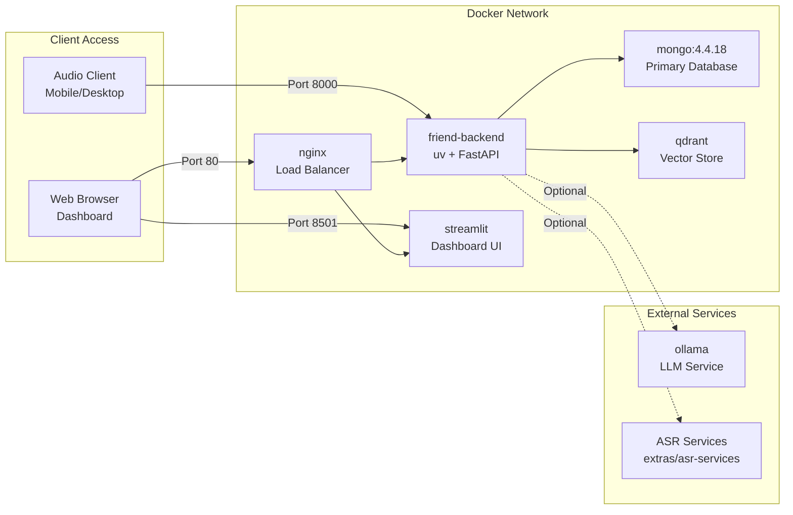

# Architecture Guide: What to Look Where

This document provides a comprehensive overview of the modular architecture after the refactoring from the original 2,923-line `main.py` file.

## Overview

The application has been restructured into a modular architecture with clear separation of concerns:

- **Core Application**: `main.py` (reduced to 206 lines)
- **Service Layer**: `services.py` for initialization and configuration
- **Audio Processing**: `audio_processing.py` for audio pipeline and transcription
- **WebSocket Handling**: `websocket_handler.py` for real-time connections
- **API Routes**: `api_routes.py` for HTTP endpoints
- **Authentication**: `auth.py` and `users.py` for user management
- **Data Models**: `models.py` for API request/response schemas
- **Extensions**: `other_services/` for pluggable transcript services

## File-by-File Guide

### 📁 Core Application Files

#### `src/main.py` (206 lines)
**What it contains:**
- FastAPI application initialization
- WebSocket endpoints (`/ws`, `/ws-pcm`)
- Application lifecycle management
- Service router registration

**Look here for:**
- Application startup and shutdown logic
- WebSocket endpoint definitions
- High-level application configuration
- Service integration points

**Key functions:**
- `lifespan()`: Application lifecycle management
- `websocket_endpoint()`: Opus audio streaming
- `pcm_websocket_endpoint()`: PCM audio streaming

#### `src/services.py`
**What it contains:**
- Database initialization and connection management
- Service factory functions
- Configuration management
- Transcript service registration

**Look here for:**
- Database setup and collections
- Service initialization (AI, transcription, memory)
- Configuration loading
- Service dependency injection

**Key functions:**
- `initialize_all_services()`: Main service initialization
- `get_database()`: Database connection and collections
- `initialize_transcript_services()`: Service manager setup

### 📁 Audio Processing

#### `src/audio_processing.py`
**What it contains:**
- Audio chunk database operations (`ChunkRepo`)
- Transcription management (`TranscriptionManager`)
- Audio cropping and processing utilities
- File sink management

**Look here for:**
- Audio file storage and management
- Speech-to-text processing
- Audio chunk database operations
- Voice activity detection handling

**Key classes:**
- `ChunkRepo`: Database operations for audio chunks
- `TranscriptionManager`: Handles Deepgram/offline ASR transcription

### 📁 WebSocket & Real-time Communication

#### `src/websocket_handler.py`
**What it contains:**
- Client state management (`ClientState`)
- WebSocket connection handling
- Audio streaming processors
- Background task management

**Look here for:**
- WebSocket connection lifecycle
- Client state tracking
- Audio pipeline processors
- Real-time audio streaming

**Key classes:**
- `ClientState`: Manages individual client connections
- Background processors for audio, transcription, memory, and services

### 📁 HTTP API

#### `src/api_routes.py`
**What it contains:**
- All HTTP REST API endpoints
- Conversation management endpoints
- User management (admin)
- Memory operations
- Debug and metrics endpoints

**Look here for:**
- REST API endpoints
- Conversation retrieval and management
- User administration features
- Memory search and management
- Application metrics and debugging

**Key endpoint groups:**
- `/health`, `/readiness`: Health checks
- `/api/conversations`: Conversation management
- `/api/users`: User management (admin)
- `/api/memories`: Memory operations
- `/api/admin/*`: Admin-only endpoints

### 📁 Authentication & User Management

#### `src/auth.py`
**What it contains:**
- FastAPI-Users configuration
- JWT authentication strategies
- User manager with custom authentication
- WebSocket authentication
- Admin user creation

**Look here for:**
- Authentication configuration
- JWT token handling
- User registration and management
- Admin user setup
- WebSocket authentication

**Key classes:**
- `UserManager`: Custom user management with email/password auth
- Authentication backends (cookie, bearer)

#### `src/users.py`
**What it contains:**
- User model definitions
- Client-user relationship management
- User database operations
- Client ID generation

**Look here for:**
- User data models
- Client registration and tracking
- User-client relationship mapping
- Database user operations

**Key classes:**
- `User`: Main user model with client tracking
- User schema classes for API operations

### 📁 Data Models

#### `src/models.py`
**What it contains:**
- API request/response models
- Essential data structures for HTTP endpoints

**Look here for:**
- API request/response schemas
- Data validation models
- Type definitions for API contracts

**Key models:**
- `SpeakerAssignment`: Speaker identification
- `TranscriptUpdate`: Transcript modification
- `CloseConversationRequest`: Conversation management

### 📁 Extensible Services

#### `src/other_services/`
**What it contains:**
- Pluggable transcript processing services
- Action items service implementation
- Service-specific API routes

**Look here for:**
- Adding new transcript processing services
- Action items business logic
- Service-specific API endpoints

**Key files:**
- `action_items_service.py`: Action items processing
- `action_items_api.py`: Action items API endpoints
- `service_interface.py`: Abstract service interface

## Architecture Patterns

### 1. Service Layer Pattern
- All services initialized in `services.py`
- Dependency injection throughout the application
- Clear separation between business logic and infrastructure

### 2. Repository Pattern
- `ChunkRepo` for audio chunk database operations
- Centralized database access patterns
- Consistent data access layer

### 3. Observer Pattern
- Transcript services receive callbacks when transcriptions complete
- Extensible processing pipeline
- Loose coupling between transcription and processing

### 4. State Management
- `ClientState` class manages individual client connections
- Centralized state tracking for WebSocket connections
- Clean lifecycle management

## Service Flow

### Audio Processing Pipeline
1. **Audio Reception**: WebSocket receives audio chunks
2. **Audio Storage**: `ChunkRepo` stores audio files and metadata
3. **Transcription**: `TranscriptionManager` processes speech-to-text
4. **Service Processing**: Transcript services (action items, etc.) process results
5. **Memory Storage**: Processed results stored in memory service

### Authentication Flow
1. **User Registration**: Email/password through `UserManager`
2. **Client Registration**: Device clients registered to users
3. **WebSocket Auth**: JWT token or cookie-based authentication
4. **API Auth**: Bearer token or cookie authentication

## Database Collections

### MongoDB Collections
- `chunks`: Audio files and transcription data
- `users`: User accounts and client relationships
- `memories`: Processed memories and insights
- `action_items`: Action items extracted from conversations

## Configuration

### Environment Variables
- `AUTH_SECRET_KEY`: JWT secret key
- `ADMIN_USERNAME`, `ADMIN_PASSWORD`: Admin user credentials
- `DATABASE_URI`: MongoDB connection string
- `DEEPGRAM_API_KEY`: Speech-to-text API key

## Adding New Features

### Adding a New Transcript Service
1. Create service class extending `TranscriptService` in `other_services/`
2. Implement `process_transcript()` method
3. Register service in `services.py`
4. Add API routes if needed

### Adding New API Endpoints
1. Add endpoint functions to `api_routes.py`
2. Use existing authentication dependencies
3. Follow existing patterns for error handling and logging

### Adding New Database Operations
1. Extend `ChunkRepo` or create new repository class
2. Add database operations in `services.py`
3. Use existing collection patterns

## Development Workflow

### Running the Application
```bash
uv run python src/main.py
```

### Testing
```bash
# Run tests (check README for specific test commands)
uv run pytest
```

### Debugging
- Check logs in console output
- Use `/health` endpoint for service status
- Use `/api/debug/*` endpoints for debugging information

## Migration Notes

### From Original Architecture
- **Before**: Single 2,923-line file with mixed concerns
- **After**: Modular architecture with clear separation
- **Benefits**: Easier testing, maintenance, and feature addition
- **Compatibility**: All existing functionality preserved

### Import Changes
- Import service functions from `services.py`
- Import audio processing from `audio_processing.py`
- Import WebSocket handlers from `websocket_handler.py`
- Import API routes from `api_routes.py`

This architecture provides a solid foundation for extending the application with new features while maintaining clean separation of concerns and testability.

## Deployment Architecture

### Docker Compose Structure


```mermaid
graph LR
    subgraph "Docker Network"
        Backend[friend-backend<br/>uv + FastAPI]
        Streamlit[streamlit<br/>Dashboard UI]
        Proxy[nginx<br/>Load Balancer]
        Mongo[mongo:4.4.18<br/>Primary Database]
        Qdrant[qdrant<br/>Vector Store]
    end
    
    subgraph "External Services"
        Ollama[ollama<br/>LLM Service]
        ASRService[ASR Services<br/>extras/asr-services]
    end
    
    subgraph "Client Access"
        WebBrowser[Web Browser<br/>Dashboard]
        AudioClient[Audio Client<br/>Mobile/Desktop]
    end
    
    WebBrowser -->|Port 8501| Streamlit
    WebBrowser -->|Port 80| Proxy
    AudioClient -->|Port 8000| Backend
    
    Proxy --> Backend
    Proxy --> Streamlit
    Backend --> Mongo
    Backend --> Qdrant
    Backend -.->|Optional| Ollama
    Backend -.->|Optional| ASRService
```

### Container Specifications

#### Backend Container (`friend-backend`)
- **Base**: Python 3.12 slim with uv package manager
- **Dependencies**: FastAPI, WebSocket libraries, audio processing tools
- **Volumes**: Audio chunk storage, debug directories
- **Health Checks**: Automated readiness and liveness probes
- **Environment**: All configuration via environment variables

#### Streamlit Container (`streamlit`)
- **Purpose**: Web dashboard interface
- **Dependencies**: Streamlit, requests, pandas for data visualization
- **Backend Integration**: HTTP API client with authentication
- **Configuration**: Backend URL configuration for API calls

#### Infrastructure Containers
- **MongoDB 4.4.18**: Primary data storage with persistence
- **Qdrant Latest**: Vector database for memory embeddings
- **Nginx Alpine**: Reverse proxy and load balancing

## Data Flow Architecture

### Audio Ingestion & Processing
1. **Client Authentication**: JWT token validation for WebSocket connection (email or user_id based)
2. **Client ID Generation**: Automatic `user_id-device_name` format creation for client identification
3. **Permission Registration**: Client-user relationship tracking in permission dictionaries
4. **Audio Streaming**: Real-time Opus/PCM packets over WebSocket with user context
5. **Per-Client Processing**: Isolated audio queues and state management per user
6. **Transcription Pipeline**: Configurable ASR service integration with user-scoped storage
7. **Conversation Lifecycle**: Automatic timeout handling and memory processing
8. **Audio Optimization**: Speech segment extraction and silence removal

### Memory & Intelligence Processing
1. **Conversation Completion**: End-of-session trigger for memory extraction
2. **User Resolution**: Client-ID to database user mapping for proper data association
3. **LLM Processing**: Ollama-based conversation summarization with user context
4. **Vector Storage**: Semantic embeddings stored in Qdrant keyed by user_id
5. **Action Item Analysis**: Automatic task detection with user-centric storage
6. **Metadata Enhancement**: Client information and user email stored in metadata
7. **Search & Retrieval**: User-scoped semantic memory search capabilities

### User Management & Security
1. **Registration**: Admin-controlled user creation with email/password and auto-generated user_id
2. **Dual Authentication**: JWT token generation for both email and user_id login methods
3. **Client Association**: Automatic client ID generation as `user_id-device_name`
4. **Permission Tracking**: Dictionary-based client-user relationship management
5. **Authorization**: Per-endpoint permission checking with simplified ownership validation
6. **Data Isolation**: User-scoped data access via client ID mapping and ownership validation
7. **OAuth Integration**: Optional Google OAuth for simplified login

## Security Architecture

### Authentication Layers
- **API Gateway**: JWT middleware on all protected endpoints with email/user_id support
- **WebSocket Security**: Custom authentication handler for real-time connections (token + cookie support)
- **Client ID Management**: Automatic generation and validation of `user_id-device_name` format
- **Permission Mapping**: Dictionary-based client-user relationship tracking
- **Role Validation**: Admin vs user permission matrix enforcement
- **Data Scoping**: Efficient user context filtering via client ID mapping

### Access Control Matrix
| Resource | Regular User | Superuser |
|----------|-------------|-----------|
| Own Conversations | Full Access | Full Access |
| Other Users' Conversations | No Access | Full Access |
| User Management | Profile Only | Full CRUD |
| System Administration | Health Check Only | Full Access |
| Active Client Management | Own Clients Only | All Clients |
| Memory Management | Own Memories Only | All Memories (with client info) |
| Action Items | Own Items Only | All Items (with client info) |

### Data Protection
- **Encryption**: JWT token signing with configurable secret keys
- **Password Security**: Bcrypt hashing with salt rounds
- **User Identification**: 6-character alphanumeric user_id system with validation
- **Data Isolation**: User ID validation on all data operations via client mapping
- **Permission Efficiency**: Dictionary-based ownership checking instead of regex patterns
- **Audit Logging**: Comprehensive request and authentication logging with user_id tracking

## Configuration & Environment

### Required Environment Variables
```bash
AUTH_SECRET_KEY=your-super-secret-jwt-key-here-make-it-long-and-random
ADMIN_PASSWORD=your-secure-admin-password
```

### Optional Service Configuration
```bash
# Database
MONGODB_URI=mongodb://mongo:27017

# LLM Processing
OLLAMA_BASE_URL=http://ollama:11434

# Vector Storage
QDRANT_BASE_URL=qdrant

# ASR Services
DEEPGRAM_API_KEY=your-deepgram-api-key
OFFLINE_ASR_TCP_URI=tcp://host.docker.internal:8765

# OAuth Integration
GOOGLE_CLIENT_ID=your-google-client-id
GOOGLE_CLIENT_SECRET=your-google-client-secret
```

### Service Dependencies

#### Critical Services (Required for Core Functionality)
- **MongoDB**: User data, conversations, action items
- **Authentication**: JWT token validation and user sessions

#### Enhanced Services (Optional but Recommended)
- **Ollama**: Memory processing and action item extraction
- **Qdrant**: Vector storage for semantic memory search
- **ASR Service**: Speech-to-text transcription (Deepgram or self-hosted)

#### External Services (Optional)
- **Google OAuth**: Simplified user authentication
- **Ngrok**: Public internet access for development
- **HAVPE Relay**: ESP32 audio streaming bridge with authentication (`extras/havpe-relay/`)

### HAVPE Relay Integration
The HAVPE relay (`extras/havpe-relay/main.py`) provides ESP32 audio streaming capabilities:

- **Authentication**: Supports both `AUTH_EMAIL` and `AUTH_USER_ID` environment variables
- **Client ID Generation**: Creates client ID as `user_id-havpe` automatically
- **Audio Processing**: Converts ESP32 32-bit stereo to 16-bit mono for backend
- **Reconnection**: Automatic JWT token refresh and WebSocket reconnection on auth failures
- **Device Name**: Configurable device identifier for multi-device support

## Performance & Scalability

### Client Isolation Design
- **Per-Client Queues**: Independent processing pipelines prevent cross-client interference
- **Async Processing**: Non-blocking audio ingestion with background processing
- **Resource Management**: Configurable timeouts and cleanup procedures
- **State Management**: Memory-efficient client state with automatic cleanup

### Monitoring & Observability
- **Health Checks**: Comprehensive service dependency validation
- **Performance Metrics**: Audio processing latency, transcription accuracy
- **Resource Tracking**: Memory usage, connection counts, processing queues
- **Error Handling**: Graceful degradation with detailed logging

This architecture supports a fully-featured conversation processing system with enterprise-grade authentication, real-time audio processing, and intelligent content analysis, all deployable via a single Docker Compose command. 