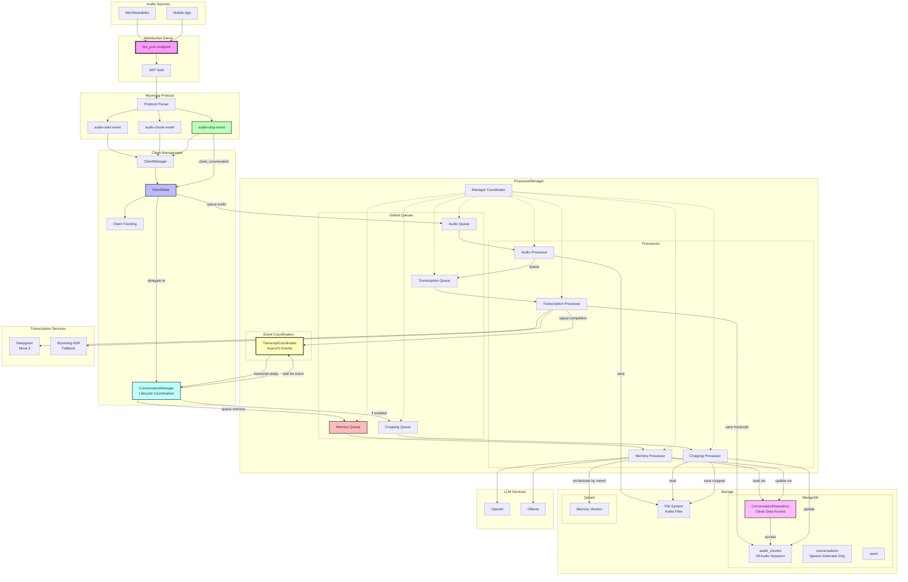
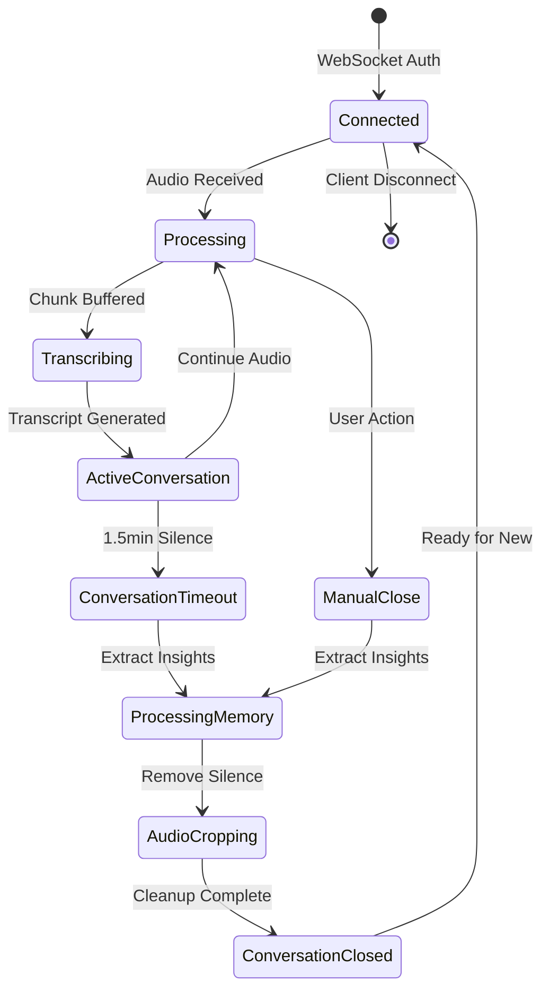

# Friend-Lite Backend Architecture

> 📖 **Prerequisite**: Read [quickstart.md](./quickstart.md) first for basic system understanding.

## System Overview


Friend-Lite is a comprehensive real-time conversation processing system that captures audio streams, performs speech-to-text transcription, and extracts memories. The system features a FastAPI backend with WebSocket audio streaming, versioned transcript and memory processing, a React web dashboard with search capabilities, and user authentication with role-based access control.


**Core Implementation**: The complete system is implemented in `src/advanced_omi_backend/main.py` with supporting services in dedicated modules, using a modular router/controller architecture pattern.

## Architecture Diagram



## Component Descriptions

### Core Application

#### FastAPI Backend (`src/advanced_omi_backend/main.py`)
- **Authentication-First Design**: All endpoints require JWT authentication
- **Wyoming Protocol WebSocket**: Real-time audio streaming using Wyoming protocol (JSONL + binary) for structured session management
- **WebSocket Audio Streaming**: Real-time Opus/PCM audio ingestion with per-client isolation
- **Conversation Management**: Session-based conversation lifecycle using Wyoming audio-start/stop events
- **REST API Suite**: Comprehensive endpoints organized in modular routers (`src/advanced_omi_backend/routers/`)
- **Health Monitoring**: Detailed service health checks and performance metrics (`src/advanced_omi_backend/routers/modules/system_routes.py`)
- **Audio Cropping**: Intelligent speech segment extraction using FFmpeg

#### Authentication System (`src/advanced_omi_backend/auth.py`)
- **FastAPI-Users Integration**: Complete user lifecycle management
- **Email Authentication**: User authentication via email and password
- **Multi-Authentication**: JWT tokens,  and cookie-based sessions
- **Role-Based Access Control**: Admin vs regular user permissions with data isolation
- **WebSocket Security**: Custom authentication for real-time connections with token/cookie support
- **Admin User Bootstrap**: Automatic admin account creation
- **Client ID Generation**: Automatic `objectid_suffix-device_name` format for client identification

> 📖 **Read more**: [Authentication Architecture](./auth.md) for complete authentication system details

#### React Dashboard (`webui/`)
- **Modern Interface**: Complete React/TypeScript web-based management interface
- **Advanced Memory Search**: Semantic search with relevance threshold filtering and live results
- **Memory Count Display**: Total count tracking with dual-layer filtering capabilities
- **Authentication Integration**: Login with backend JWT tokens and user management
- **Real-Time Monitoring**: Live client status and conversation management
- **Live Recording**: Real-time audio recording with WebSocket streaming (HTTPS)
- **Data Management**: User, conversation, and memory interfaces with enhanced UX
- **Audio Playback**: Smart audio player with original/cropped audio options
- **System Health**: Visual service status and configuration display

### Wyoming Protocol Implementation

The system implements Wyoming protocol for structured WebSocket audio communication, providing clear session boundaries and improved conversation management.

#### Protocol Overview
Wyoming is a peer-to-peer protocol for voice assistants that combines JSONL (JSON Lines) headers with binary audio payloads:

**Protocol Format**:
```
{JSON_HEADER}\n
<binary_payload>
```

#### Supported Events

**Audio Session Events**:
- **audio-start**: Signals the beginning of an audio recording session
  ```json
  {"type": "audio-start", "data": {"rate": 16000, "width": 2, "channels": 1}, "payload_length": null}
  ```

- **audio-chunk**: Contains raw audio data with format metadata
  ```json
  {"type": "audio-chunk", "data": {"rate": 16000, "width": 2, "channels": 1}, "payload_length": 320}
  <320 bytes of PCM/Opus audio data>
  ```

- **audio-stop**: Signals the end of an audio recording session
  ```json
  {"type": "audio-stop", "data": {"timestamp": 1234567890}, "payload_length": null}
  ```

#### Backend Implementation

**Advanced Backend (`/ws_pcm`)**:
- **Full Wyoming Protocol Support**: Parses all Wyoming events for comprehensive session management
- **Session State Tracking**: Only processes audio chunks when session is active (after receiving audio-start)
- **Conversation Boundaries**: Uses Wyoming audio-start/stop events to define precise conversation segments
- **PCM Audio Processing**: Direct processing of PCM audio data from all apps

**Advanced Backend (`/ws_omi`)**:
- **Wyoming Protocol + Opus Decoding**: Combines Wyoming session management with OMI Opus decoding
- **Continuous Streaming**: OMI devices stream continuously, audio-start/stop events are optional
- **Timestamp Preservation**: Uses timestamps from Wyoming headers when provided
- **Dynamic Sample Rate**: Automatically detects and adapts to client sample rate (typically 16kHz for OMI devices, but supports other rates)

**Simple Backend (`/ws`)**:
- **Minimal Wyoming Support**: Parses audio-chunk events, silently ignores control events
- **Opus Processing**: Handles Opus-encoded audio chunks from Wyoming protocol messages
- **Legacy Compatibility**: Maintains support for raw Opus packet streaming

#### Protocol Parser Implementation
Both backends include a Wyoming protocol parser (`parse_wyoming_protocol()`) that:
- Detects message type (JSONL header vs. raw binary)
- Parses JSON headers and extracts payload length
- Reads binary payloads when specified
- Provides backward compatibility for non-Wyoming clients

#### Benefits
- **Clear Session Boundaries**: Eliminates timeout-based conversation detection
- **Structured Communication**: Consistent protocol across all audio streaming interfaces
- **Future Extensibility**: Foundation for additional event types (pause, resume, metadata)
- **Universal App Integration**: Simple implementation for all WebSocket clients (mobile, desktop, web)
- **Backward Compatibility**: Existing raw audio streaming clients continue to work

### Audio Processing Pipeline

#### Transcription Architecture

The system implements a dual transcription approach with Deepgram as primary and Wyoming ASR as fallback:

**Deepgram Batch Processing**:
- **Model**: Nova-3 (Deepgram's latest high-accuracy model)
- **Features**: Smart formatting, punctuation, speaker diarization
- **Processing**: Collect-then-process approach using REST API
- **Timeout**: 1.5 minute collection timeout for optimal quality
- **Client Manager Integration**: Uses centralized ClientManager for clean client state access
- **Configuration**: Auto-enables when `DEEPGRAM_API_KEY` environment variable is present

**Wyoming ASR Fallback**:
- **Purpose**: Offline fallback when Deepgram unavailable
- **Protocol**: TCP connection to self-hosted Wyoming ASR service
- **Event-Driven**: Asynchronous event processing with background queue management
- **Graceful Degradation**: Seamless fallback without service interruption

**TranscriptionManager Architecture**:
```python
# Clean dependency injection pattern
TranscriptionManager(
    chunk_repo=database_repo,
    # Uses get_client_manager() singleton for client state access
)
```

#### Client Manager Architecture

The system uses a centralized **ClientManager** for managing active client connections and state:

**Centralized Client Management**:
```python
# Singleton pattern for global client state access
client_manager = get_client_manager()

# Client state management
client_state = ClientState(
    client_id="user_id_suffix-device_name",
    chunk_repo=database_repo,
    chunk_dir=audio_storage_path
)
```

**Client ID Format**: `{objectid_suffix}-{device_name}`
- Uses last 6 characters of MongoDB ObjectId + device name
- Examples: `cd7994-laptop`, `e26efe-upload-001`
- Ensures unique identification across users and devices

**Key Features**:
- **Connection Tracking**: Real-time monitoring of active clients
- **State Management**: Simplified client state for conversation tracking only
- **Centralized Processing**: Application-level processors handle all background tasks
- **Dynamic Sample Rate**: Client state tracks actual sample rate from audio chunks
- **Audio Buffer Management**: Sophisticated buffer system with timing and collection management

### Audio Buffer Management

The system implements advanced audio buffer management for reliable processing:

**Buffer Collection**:
- **Retention**: Configurable buffer retention (default 120 seconds for speaker identification)
- **Timeout**: 1.5 minute collection timeout to prevent indefinite buffering
- **Isolation**: Each client maintains isolated buffer state
- **Dynamic Sizing**: Adapts to actual sample rate and chunk sizes

**Buffer State Tracking**:
- Sample rate detection from incoming audio chunks
- Automatic fallback to default rates when not specified
- Buffer timing synchronization for accurate segment extraction
- Memory-efficient circular buffer implementation

### Application-Level Processing Architecture

The system has been refactored from per-client processing to application-level processing for improved reliability and resource management:

**Processor Manager**:
```python
# Centralized processing with global queues
ProcessorManager(
    audio_queue=asyncio.Queue(),          # Audio file management
    transcription_queue=asyncio.Queue(),  # Deepgram/Wyoming ASR
    memory_queue=asyncio.Queue(),         # LLM processing
    cropping_queue=asyncio.Queue()        # Speech segment extraction
)
```

**Background Task Manager**:
```python
# Centralized task tracking prevents orphaned processes
BackgroundTaskManager(
    tasks={},                    # Active task tracking
    completed_tasks=[],          # Completed task history
    max_completed_history=1000   # Task history limit
)
```

**Key Benefits**:
- **Prevents Orphaned Processes**: All background tasks tracked centrally
- **Processing Continues After Disconnect**: Tasks complete even if client disconnects
- **Resource Leak Prevention**: Proper cleanup of TCP connections, file handles, threads
- **Robust Error Handling**: Comprehensive exception handling with guaranteed cleanup
- **Task Timeout Management**: Automatic cancellation of long-running tasks

**Architecture Changes**:
- **ClientState**: Simplified to state management only (conversation tracking, speech segments)
- **ProcessorManager**: Handles all audio, transcription, memory, and cropping tasks
- **TaskManager**: Tracks all background tasks with health monitoring
- **Exception Safety**: WebSocket handlers use try/finally for guaranteed cleanup
- **Resource Management**: Automatic cleanup on client disconnect
- **Multi-Device Support**: Single user can have multiple active clients
- **Thread-Safe Operations**: Concurrent client access with proper synchronization

### Conversation Closure and Memory Processing

**Recent Architecture Changes**: 
1. Memory processing decoupled from transcription to prevent duplicates
2. **Event-driven coordination** eliminates polling/retry race conditions

#### Previous Architecture (Had Issues)
```
Transcription Complete → Queue Memory Processing ❌ (Duplicate)
                    ↓
Conversation Close → Queue Memory Processing ❌ (Duplicate)
```

#### Current Architecture (Event-Driven)
```
Transcription Complete → Save Transcript + Signal Event ✓
                                           ↓
Conversation Close → Wait for Event → Queue Memory Processing ✓
```

#### Event Coordination System
The system now uses **TranscriptCoordinator** for proper async coordination:

```python
class TranscriptCoordinator:
    async def wait_for_transcript_completion(audio_uuid: str) -> bool:
        # Wait for asyncio.Event (no polling!)
        
    def signal_transcript_ready(audio_uuid: str):
        # Signal completion from TranscriptionManager
```

**Benefits:**
- ✅ **Zero polling** - Uses asyncio events instead of sleep/retry loops
- ✅ **Immediate processing** - Memory processor starts as soon as transcript is ready  
- ✅ **No race conditions** - Proper async coordination prevents timing issues
- ✅ **Better performance** - No artificial delays or timeout-based waiting

#### New Architecture Components

**TranscriptCoordinator** (`transcript_coordinator.py`)
- **Event-Driven Coordination**: Manages asyncio.Event objects for transcript completion
- **Zero-Polling Design**: Eliminates sleep/retry loops in favor of proper async events
- **Global Singleton**: Centralized coordination across all processors
- **Automatic Cleanup**: Events are cleaned up after use to prevent memory leaks

**ConversationManager** (`conversation_manager.py`)
- **Lifecycle Management**: Handles complete conversation closure workflow
- **Single Responsibility**: Separated from ClientState for cleaner architecture
- **Processing Coordination**: Manages memory processing and audio cropping queuing
- **Error Handling**: Comprehensive error handling with success/failure tracking

**ConversationRepository** (`conversation_repository.py`)
- **Repository Pattern**: Clean abstraction for conversation data access
- **Event Integration**: Signals TranscriptCoordinator when transcripts are saved
- **Domain-Focused Methods**: High-level methods like `get_full_conversation_text()`
- **Proper Error Handling**: All database operations wrapped with try/catch and logging

#### Conversation Closure Triggers

The `close_conversation()` method in ClientState now delegates to ConversationManager:

1. **Wyoming Protocol `audio-stop` Event** (Primary Path)
   - Explicit session end from client
   - Most reliable trigger
   - Immediate processing

2. **Client Disconnect** 
   - WebSocket connection closed
   - Cleanup handler ensures closure
   - Prevents orphaned conversations

3. **Manual API Call**
   - `/api/conversations/{client_id}/close` endpoint
   - User-initiated closure
   - UI button in React dashboard

4. **Conversation Timeout** (Not shown in diagram)
   - 1.5 minute silence detection
   - Automatic closure for inactive sessions

#### Memory Processing Flow

When `close_conversation()` is called:

```python
async def close_current_conversation(self):
    # 1. Check if conversation has content
    if not self.has_transcripts():
        return  # No memory processing needed
    
    # 2. Save conversation to MongoDB
    audio_uuid = await self.save_conversation()
    
    # 3. Queue memory processing (ONLY place this happens)
    if audio_uuid and self.has_required_data():
        processor_manager.queue_memory_processing({
            'audio_uuid': audio_uuid,
            'user_id': self.user_id,
            'transcript': self.get_transcript()
        })
    
    # 4. Queue audio cropping if enabled
    if self.audio_cropping_enabled:
        processor_manager.queue_audio_cropping(audio_path)
    
    # 5. Reset state for next conversation
    self.reset_conversation_state()
```

#### Reliability Considerations

**Q: Can `close_conversation` fail to be called?**

Potential failure scenarios:
1. **Server crash before processing `audio-stop`** - Mitigated by disconnect handler
2. **Network failure during event transmission** - Client reconnect triggers new session
3. **Client bug that doesn't send `audio-stop`** - Disconnect handler ensures cleanup

**Q: Is memory processing guaranteed?**

Current guarantee: **Best effort with multiple fallbacks**
- Primary trigger: Wyoming protocol events
- Fallback 1: Client disconnect handler
- Fallback 2: Manual API endpoint
- Future improvement: Periodic sweep for unprocessed conversations

#### Per-Client State Management


#### Audio Processing Queues (Per-Client)
- **Chunk Queue**: Raw audio buffering with client isolation
- **Transcription Queue**: Audio chunks for real-time ASR processing with quality validation
- **Memory Queue**: Completed conversations for LLM memory extraction (with transcript validation)
- **Quality Control**: Multi-stage validation prevents empty/invalid transcripts from consuming LLM resources

#### Speech Processing Features
- **Voice Activity Detection**: Automatic silence removal and speech segment extraction
- **Audio Cropping**: FFmpeg-based processing to create concise audio files
- **Multiple Format Support**: Opus (compressed) and PCM (uncompressed) audio input
- **Conversation Chunking**: 60-second segments with seamless processing

### Intelligence Services


#### Memory Management (`src/advanced_omi_backend/memory/memory_service.py`)
- **User-Centric Storage**: All memories keyed by database user_id (not client_id)
- **Conversation Summarization**: Automatic memory extraction using mem0 framework
- **Vector Storage**: Semantic memory search with Qdrant embeddings
- **Client Metadata**: Client information stored in memory metadata for reference
- **User Isolation**: Complete data separation between users via user_id
- **Temporal Memory**: Long-term conversation history with semantic retrieval
- **Processing Trigger**: Conversation end events processed by `src/advanced_omi_backend/controllers/memory_controller.py`

> 📖 **Read more**: [Memory System Documentation](./memories.md) for detailed memory extraction and storage


### Data Models & Access

#### User Management (`src/advanced_omi_backend/users.py`)
- **Beanie ODM**: MongoDB document modeling with type safety
- **User ID System**: MongoDB ObjectId-based user identification
- **Authentication Data**: Secure password hashing, email verification, email-based login
- **Profile Management**: User preferences, display names, and permissions
- **Client Registration**: Tracking of registered clients per user with device names
- **Data Ownership**: All data (conversations, memories) associated via user_id
- **Client ID Generation**: Helper functions for `objectid_suffix-device_name` format

#### Conversation Data Access (`src/advanced_omi_backend/conversation_repository.py`)
- **Audio Metadata**: File paths, timestamps, duration tracking
- **Transcript Management**: Speaker identification and timing information
- **Memory Links**: Connection between conversations and extracted memories

#### Permission System
- **Dictionary-Based Mapping**: Clean client-user relationship tracking via in-memory dictionaries
- **Active Client Tracking**: `client_to_user_mapping` for currently connected clients
- **Persistent Tracking**: `all_client_user_mappings` for database query permission checks
- **Ownership Validation**: Simple dictionary lookup instead of regex pattern matching
- **Data Isolation**: User-scoped queries using client ID lists for efficient permission filtering

## Deployment Architecture

### Docker Compose Structure

```mermaid
graph LR
    subgraph "Docker Network"
        Backend[friend-backend<br/>uv + FastAPI]
        WebUI[webui<br/>React Dashboard]
        Proxy[nginx<br/>Load Balancer]
        Mongo[mongo:4.4.18<br/>Primary Database]
        Qdrant[qdrant<br/>Vector Store]
    end
    
    subgraph "External Services"
        Ollama[ollama<br/>LLM Service]
        ASRService[ASR Services<br/>extras/asr-services]
    end
    
    subgraph "Client Access"
        WebBrowser[Web Browser<br/>Dashboard]
        AudioClient[Audio Client<br/>Mobile/Desktop]
    end
    
    WebBrowser -->|Port 5173 (dev)| WebUI
    WebBrowser -->|Port 80 (prod)| Proxy
    AudioClient -->|Port 8000| Backend
    
    Proxy --> Backend
    Proxy --> WebUI
    Backend --> Mongo
    Backend --> Qdrant
    Backend -.->|Optional| Ollama
    Backend -.->|Optional| ASRService
```

### Container Specifications

#### Backend Container (`friend-backend`)
- **Base**: Python 3.12 slim with uv package manager
- **Dependencies**: FastAPI, WebSocket libraries, audio processing tools
- **Volumes**: Audio chunk storage, debug directories
- **Health Checks**: Automated readiness and liveness probes
- **Environment**: All configuration via environment variables

#### React WebUI Container (`webui`)
- **Purpose**: Modern React-based web dashboard interface
- **Dependencies**: React, TypeScript, Vite for development, Nginx for production
- **Backend Integration**: HTTP API client with JWT authentication
- **Configuration**: Backend URL configuration for API calls
- **Development**: Vite dev server on port 5173
- **Production**: Nginx serving built React app on port 80

#### Infrastructure Containers
- **MongoDB 4.4.18**: Primary data storage with persistence
- **Qdrant Latest**: Vector database for memory embeddings
- **Neo4j 5.15**: Graph database for memory relationships and entity connections
- **Nginx Alpine**: Reverse proxy and load balancing (serves React app in production, proxies API calls to backend)

## Detailed Data Flow Architecture

> 📖 **Reference Documentation**: 
> - [Authentication Details](./auth.md) - Complete authentication system documentation

### Complete System Data Flow Diagram

```mermaid
flowchart TB
    %% External Clients
    Client[📱 Audio Client<br/>Mobile/Desktop/HAVPE]
    WebUI[🌐 Web Dashboard<br/>React Web UI]

    %% Authentication Gateway
    subgraph "🔐 Authentication Layer"
        AuthGW[JWT/Cookie Auth<br/>🕐 1hr token lifetime]
        ClientGen[Client ID Generator<br/>user_suffix-device_name]
        UserDB[(👤 User Database<br/>MongoDB ObjectId)]
    end

    %% Audio Processing Pipeline
    subgraph "🎵 Audio Processing Pipeline"
        WSAuth[WebSocket Auth<br/>🕐 Connection timeout: 30s]
        OpusDecoder[Opus/PCM Decoder<br/>Real-time Processing]
        
        subgraph "⏱️ Per-Client State Management"
            ClientState[Client State<br/>🕐 Conversation timeout: 1.5min]
            AudioQueue[Audio Chunk Queue<br/>60s segments]
            ConversationTimer[Conversation Timer<br/>🔄 Auto-timeout tracking]
        end
        
        subgraph "🎙️ Transcription Layer"
            ASRManager[Transcription Manager<br/>🕐 Init timeout: 60s]
            DeepgramWS[Deepgram WebSocket<br/>Nova-3 Model, Smart Format<br/>🔌 Auto-reconnect on disconnect]
            OfflineASR[Wyoming ASR Fallback<br/>🕐 Connect timeout: 5s]
            ClientManager[Client Manager<br/>Centralized client state access]
            TranscriptValidation[Transcript Validation<br/>📏 Min 10 chars]
        end
    end

    %% Intelligence Services
    subgraph "🧠 Intelligence Processing"
        subgraph "💭 Memory Pipeline"
            MemoryService[Memory Service<br/>🕐 Init timeout: 60s<br/>🕐 Processing timeout: 20min]
            MemoryValidation[Memory Validation<br/>📏 Min conversation length]
            LLMProcessor[Ollama LLM<br/>🔄 Circuit breaker protection]
            VectorStore[Qdrant Vector Store<br/>🔍 Semantic search]
        end
        
    end


    %% Data Storage
    subgraph "💾 Data Storage Layer"
        MongoDB[(MongoDB<br/>Users & Conversations<br/>🕐 Health check: 5s)]
        QdrantDB[(Qdrant<br/>Vector Embeddings<br/>🔍 Semantic memory)]
        AudioFiles[Audio Files<br/>📁 Chunk storage + cropping]
    end

    %% Connection Flow with Timeouts
    Client -->|🔐 Auth Token| AuthGW
    AuthGW -->|❌ 401 Unauthorized<br/>⏱️ Invalid/expired token| Client
    AuthGW -->|✅ Validated| ClientGen
    ClientGen -->|🏷️ Generate client_id| WSAuth
    
    %% Audio Processing Flow
    Client -->|🎵 Opus/PCM Stream<br/>🕐 30s connection timeout| WSAuth
    WSAuth -->|❌ 1008 Policy Violation<br/>🔐 Auth required| Client
    WSAuth -->|✅ Authenticated| OpusDecoder
    OpusDecoder -->|📦 Audio chunks| ClientState
    ClientState -->|⏱️ 1.5min timeout check| ConversationTimer
    ConversationTimer -->|🔄 Timeout exceeded| ClientState
    
    %% Transcription Flow with Failure Points
    ClientState -->|🎵 Audio data| ASRManager
    ASRManager -->|🔌 Primary connection| DeepgramWS
    ASRManager -->|🔌 Fallback connection| OfflineASR
    ASRManager -->|📋 Client state access| ClientManager
    DeepgramWS -->|❌ WebSocket disconnect<br/>🔄 Auto-reconnect after 2s| ASRManager
    OfflineASR -->|❌ TCP connection timeout<br/>🕐 5s limit| ASRManager
    ASRManager -->|📝 Raw transcript| TranscriptValidation
    TranscriptValidation -->|❌ Too short (<10 chars)<br/>🚫 Skip processing| QueueTracker
    TranscriptValidation -->|✅ Valid transcript| MemoryService

    %% Memory Processing with Timeouts
    MemoryService -->|🕐 20min timeout| LLMProcessor
    LLMProcessor -->|❌ Model stopped<br/>🔄 Circuit breaker trip| CircuitBreaker
    LLMProcessor -->|❌ Empty response<br/>🔄 Fallback memory| MemoryService
    LLMProcessor -->|✅ Memory extracted| VectorStore
    MemoryService -->|📊 Track processing| QueueTracker
    

    %% Disconnect and Cleanup Flow
    Client -->|🔌 Disconnect| ClientState
    ClientState -->|🧹 Cleanup tasks<br/>🕐 Background memory: 5min<br/>🕐 Transcription queue: 60s| ASRManager
    ASRManager -->|🔌 Graceful disconnect<br/>🕐 2s timeout| DeepgramWS
    ClientState -->|🔄 Final conversation processing| MemoryService

    %% Storage Integration
    MemoryService -->|💾 Store memories| MongoDB
    VectorStore -->|💾 Embeddings| QdrantDB
    QueueTracker -->|📊 Metrics & tracking| SQLiteTracking
    ClientState -->|📁 Audio segments| AudioFiles

    %% Web Dashboard Flow
    WebUI -->|🔐 Cookie/JWT auth<br/>🕐 1hr lifetime| AuthGW
    WebUI -->|📊 API calls| MongoDB
    WebUI -->|🎵 Audio playback| AudioFiles
```

### Critical Timeout and Failure Points

#### 🕐 **Timeout Configuration**
| Component | Timeout Value | Failure Behavior | Recovery Action |
|-----------|---------------|------------------|-----------------|
| **JWT Tokens** | 1 hour | 401 Unauthorized | Client re-authentication required |
| **WebSocket Connection** | 30 seconds | Connection dropped | Client reconnection with auth |
| **Conversation Auto-Close** | 1.5 minutes | New conversation started | Memory processing triggered |
| **Transcription Queue** | 60 seconds | Queue processing timeout | Graceful degradation |
| **Memory Service Init** | 60 seconds | Service unavailable | Health check failure |
| **Ollama Processing** | 20 minutes | LLM timeout | Fallback memory creation |
| **Background Memory Task** | 5 minutes | Task cancellation | Partial processing retained |
| **MongoDB Health Check** | 5 seconds | Service marked unhealthy | Circuit breaker activation |
| **Ollama Health Check** | 8 seconds | Service marked unhealthy | Circuit breaker activation |
| **ASR Connection** | 5 seconds | Connection failure | Fallback ASR or degraded mode |

#### 🔌 **Disconnection Scenarios**
1. **Client Disconnect**: Graceful cleanup with conversation finalization
2. **Network Interruption**: Auto-reconnection with exponential backoff  
3. **Service Failure**: Circuit breaker protection and alternative routing
4. **Authentication Expiry**: Forced re-authentication with clear error codes


### Audio Ingestion & Processing
1. **Client Authentication**: JWT token validation for WebSocket connection (email or user_id based)
2. **Client ID Generation**: Automatic `user_id-device_name` format creation for client identification
3. **Permission Registration**: Client-user relationship tracking in permission dictionaries
4. **Audio Streaming**: Real-time Opus/PCM packets over WebSocket with user context
5. **Per-Client Processing**: Isolated audio queues and state management per user
6. **Audio Session Storage**: All audio sessions stored in `audio_chunks` collection by `audio_uuid`
7. **Speech Detection**: Automatic analysis of transcript content for meaningful speech
8. **Conversation Creation**: User-facing conversations created in `conversations` collection only when speech detected
9. **Transcription Pipeline**: Configurable ASR service integration with versioned storage
10. **Conversation Lifecycle**: Automatic timeout handling and memory processing
11. **Audio Optimization**: Speech segment extraction and silence removal

#### Critical Timing Considerations
**Transcription Manager Creation Race Condition**: When processing uploaded audio files, there's a timing dependency between:
- Audio chunks being queued via `processor_manager.queue_audio()` (synchronous)
- Transcription manager creation in background `_transcription_processor()` (asynchronous)
- `close_client_audio()` call to flush final transcript (immediate)

**Solution**: A 2-second delay is added before calling `close_client_audio()` to ensure the transcription manager is created by the background processor. Without this delay, the flush call fails silently and transcription never completes.

**File Upload Flow**:
1. Audio chunks queued to `transcription_queue` 
2. Background transcription processor creates `TranscriptionManager` on first chunk
3. 2-second delay ensures manager exists before flush
4. Client audio closure triggers transcript completion

### Memory & Intelligence Processing
1. **Conversation Completion**: End-of-session trigger for memory extraction (speech-detected conversations only)
2. **Transcript Validation**: Multi-layer validation prevents empty/short transcripts from reaching LLM implemented in memory controller
3. **User Resolution**: Client-ID to database user mapping for proper data association
4. **Versioned Processing**: Multiple transcript and memory versions with provider/model tracking
5. **LLM Processing**: Ollama-based conversation summarization with user context (only for validated transcripts)
6. **Vector Storage**: Semantic embeddings stored in Qdrant keyed by user_id
7. **Metadata Enhancement**: Client information and user email stored in metadata
8. **Reprocessing Capabilities**: Re-run transcript or memory extraction with different parameters
9. **Version Management**: Active version pointers with automatic legacy field population
10. **Search & Retrieval**: User-scoped semantic memory search capabilities

### User Management & Security
1. **Registration**: Admin-controlled user creation with email/password and auto-generated user_id
2. **Dual Authentication**: JWT token generation for both email and user_id login methods
3. **Client Association**: Automatic client ID generation as `user_id-device_name`
4. **Permission Tracking**: Dictionary-based client-user relationship management
5. **Authorization**: Per-endpoint permission checking with simplified ownership validation
6. **Data Isolation**: User-scoped data access via client ID mapping and ownership validation

## Speaker Recognition Integration

The advanced backend integrates with an external speaker recognition service for real-time speaker identification during conversations.

### Integration Architecture

**Service Communication**:
- **HTTP API**: RESTful endpoints for speaker enrollment and management
- **Real-time Processing**: Speaker identification during live transcription
- **Asynchronous Pipeline**: Non-blocking speaker identification parallel to transcription

**Key Features**:
- **Dynamic Enrollment**: Add speakers through audio samples
- **Live Identification**: Real-time speaker recognition during conversations
- **Confidence Scoring**: Adjustable thresholds for identification accuracy
- **Multi-speaker Support**: Handles conversations with multiple participants

### Speaker Recognition Flow

1. **Audio Collection**: Capture audio chunks with proper buffering
2. **Feature Extraction**: Generate speaker embeddings from audio segments
3. **Identity Matching**: Compare against enrolled speaker database
4. **Result Integration**: Enhance transcripts with speaker identification

### Configuration

```yaml
# Environment variables for speaker recognition
SPEAKER_SERVICE_URL: "http://speaker-recognition:8001"
SPEAKER_CONFIDENCE_THRESHOLD: 0.15  # Adjustable confidence level
```

### API Endpoints

- `POST /api/speaker/enroll` - Enroll new speaker with audio samples
- `GET /api/speaker/list` - List enrolled speakers
- `POST /api/speaker/identify` - Identify speaker from audio segment
- `DELETE /api/speaker/{speaker_id}` - Remove enrolled speaker

## Security Architecture

### Authentication Layers
- **API Gateway**: JWT middleware on all protected endpoints with email/user_id support
- **WebSocket Security**: Custom authentication handler for real-time connections (token + cookie support)
- **Client ID Management**: Automatic generation and validation of `user_id-device_name` format
- **Permission Mapping**: Dictionary-based client-user relationship tracking
- **Role Validation**: Admin vs user permission matrix enforcement
- **Data Scoping**: Efficient user context filtering via client ID mapping

### Access Control Matrix
| Resource | Regular User | Superuser |
|----------|-------------|-----------|
| Own Conversations | Full Access | Full Access |
| Other Users' Conversations | No Access | Full Access |
| User Management | Profile Only | Full CRUD |
| System Administration | Health Check Only | Full Access |
| Active Client Management | Own Clients Only | All Clients |
| Memory Management | Own Memories Only | All Memories (with client info) |

### Data Protection
- **Encryption**: JWT token signing with configurable secret keys
- **Password Security**: Bcrypt hashing with salt rounds
- **User Identification**: MongoDB ObjectId-based user system
- **Data Isolation**: User ID validation on all data operations via client mapping
- **Permission Efficiency**: Dictionary-based ownership checking instead of regex patterns
- **Audit Logging**: Comprehensive request and authentication logging with user_id tracking

## Configuration & Environment

### Required Environment Variables
```bash
AUTH_SECRET_KEY=your-super-secret-jwt-key-here-make-it-long-and-random
ADMIN_PASSWORD=your-secure-admin-password
```

### Optional Service Configuration
```bash
# Database
MONGODB_URI=mongodb://mongo:27017

# LLM Processing
OLLAMA_BASE_URL=http://ollama:11434

# Vector Storage
QDRANT_BASE_URL=qdrant

# Graph Storage for Memory Relationships
NEO4J_HOST=neo4j-mem0
NEO4J_USER=neo4j
NEO4J_PASSWORD=your-neo4j-password

# Transcription Services (Deepgram Primary, Wyoming Fallback)
DEEPGRAM_API_KEY=your-deepgram-api-key-here

```

### Service Dependencies

#### Critical Services (Required for Core Functionality)
- **MongoDB**: User data, conversations
- **Authentication**: JWT token validation and user sessions

#### Enhanced Services (Optional but Recommended)
- **Ollama**: Memory processing
- **Qdrant**: Vector storage for semantic memory search
- **Neo4j**: Graph database for memory relationships and entity connections
- **Deepgram**: Primary speech-to-text transcription service (WebSocket streaming)
- **Wyoming ASR**: Fallback transcription service (self-hosted)

#### External Services (Optional)
- **Ngrok**: Public internet access for development
- **HAVPE Relay**: ESP32 audio streaming bridge with authentication (`extras/havpe-relay/`)

### HAVPE Relay Integration
The HAVPE relay (`extras/havpe-relay/main.py`) provides ESP32 audio streaming capabilities:

- **Authentication**: Supports both `AUTH_EMAIL` and `AUTH_USER_ID` environment variables
- **Client ID Generation**: Creates client ID as `user_id-havpe` automatically
- **Audio Processing**: Converts ESP32 32-bit stereo to 16-bit mono for backend
- **Reconnection**: Automatic JWT token refresh and WebSocket reconnection on auth failures
- **Device Name**: Configurable device identifier for multi-device support

## REST API Architecture

The system provides a comprehensive REST API organized into functional modules using a router/controller pattern:

### Router/Controller Architecture
```
src/advanced_omi_backend/
├── routers/                    # Route definitions
│   ├── api_router.py          # Main API router aggregation
│   └── modules/               # Modular route organization
│       ├── user_routes.py     # User management routes
│       ├── client_routes.py   # Client monitoring routes
│       ├── conversation_routes.py # Conversation routes
│       ├── memory_routes.py   # Memory management routes
│       └── system_routes.py   # System utilities routes
└── controllers/               # Business logic controllers
    ├── user_controller.py     # User management logic
    ├── client_controller.py   # Client monitoring logic
    ├── conversation_controller.py # Conversation logic
    ├── memory_controller.py   # Memory processing logic
    └── system_controller.py   # System utilities logic
```

### API Organization
```
/api/
├── /users                    # User management (admin only)
├── /clients/active          # Active client monitoring
├── /conversations           # Conversation CRUD operations (speech-detected only)
│   ├── /{conversation_id}/reprocess-transcript  # Transcript reprocessing
│   ├── /{conversation_id}/reprocess-memory      # Memory reprocessing
│   ├── /{conversation_id}/versions              # Version history
│   ├── /{conversation_id}/activate-transcript   # Switch transcript version
│   └── /{conversation_id}/activate-memory       # Switch memory version
├── /memories               # Memory management and search
│   ├── /admin              # Admin view (all users)
│   └── /search             # Semantic memory search
├── /admin/                 # Admin compatibility endpoints
│   ├── /memories           # Consolidated admin memory view
│   └── /memories/debug     # Legacy debug endpoint
└── /active_clients         # Client monitoring (compatibility)
```

### Key Endpoints

#### User & Authentication
- `POST /auth/jwt/login` - Email/password authentication
- `GET /api/users` - User management (admin only)
- `POST /api/create_user` - User creation (admin only)

#### Client Management
- `GET /api/clients/active` - Active client monitoring (unified endpoint)

#### Memory Management
- `GET /api/memories` - User memories (with user_id filter for admin)
- `GET /api/memories/admin` - All memories grouped by user (admin only)
- `GET /api/memories/search?query=` - Semantic memory search

#### Audio & Conversations
- `GET /api/conversations` - User conversations (speech-detected only)
- `GET /api/conversations/{conversation_id}` - Specific conversation details
- `POST /api/conversations/{conversation_id}/reprocess-transcript` - Re-run transcript processing
- `POST /api/conversations/{conversation_id}/reprocess-memory` - Re-extract memories
- `GET /api/conversations/{conversation_id}/versions` - Get version history
- `POST /api/conversations/{conversation_id}/activate-transcript` - Switch transcript version
- `POST /api/conversations/{conversation_id}/activate-memory` - Switch memory version
- `POST /api/process-audio-files` - Batch audio file processing
- WebSocket `/ws_omi` - Real-time Opus audio streaming with Wyoming protocol (OMI devices)
- WebSocket `/ws_pcm` - Real-time PCM audio streaming with Wyoming protocol (all apps)

### Authentication & Authorization
- **JWT Tokens**: All API endpoints require valid JWT authentication
- **User Isolation**: Regular users see only their own data
- **Admin Access**: Superusers can access cross-user data with `user_id` filters
- **WebSocket Auth**: Token or cookie-based authentication for real-time connections

### Data Formats
```json
// Active clients response
{
  "clients": [
    {
      "client_id": "cd7994-laptop",
      "user_id": "507f1f77bcf86cd799439011",
      "connected_at": "2025-01-15T10:30:00Z",
      "conversation_count": 3  // speech-detected conversations only
    }
  ],
  "active_clients_count": 1,
  "total_count": 1
}

// Conversation with versions response
{
  "conversation_id": "conv_12345",
  "audio_uuid": "audio_67890",
  "transcript": "Active transcript content",  // from active version
  "active_transcript_version": "version_abc",
  "active_memory_version": "version_def",
  "transcript_versions": [
    {
      "version_id": "version_abc",
      "provider": "deepgram",
      "created_at": "2025-01-15T10:30:00Z",
      "transcript": "Processed content"
    }
  ],
  "memory_versions": [
    {
      "version_id": "version_def",
      "provider": "friend_lite",
      "created_at": "2025-01-15T10:32:00Z",
      "memory_count": 5
    }
  ]
}

// Admin memories response
{
  "memories": [...],           // Flat list for compatibility
  "user_memories": {...},      // Grouped by user_id
  "stats": {
    "total_memories": 150,
    "total_users": 5,
    "users_with_memories": ["user1", "user2"],
    "client_ids_with_memories": ["cd7994-laptop", "e26efe-upload"]
  }
}
```

## Performance & Scalability

### Client Isolation Design
- **Per-Client Queues**: Independent processing pipelines prevent cross-client interference
- **Async Processing**: Non-blocking audio ingestion with background processing
- **Resource Management**: Configurable timeouts and cleanup procedures
- **State Management**: Memory-efficient client state with automatic cleanup

### Monitoring & Observability
- **Health Checks**: Comprehensive service dependency validation
- **Performance Metrics**: Audio processing latency, transcription accuracy
- **Resource Tracking**: Memory usage, connection counts, processing queues
- **Error Handling**: Graceful degradation with detailed logging
- **System Tracking**: Debug tracking and monitoring via SystemTracker
