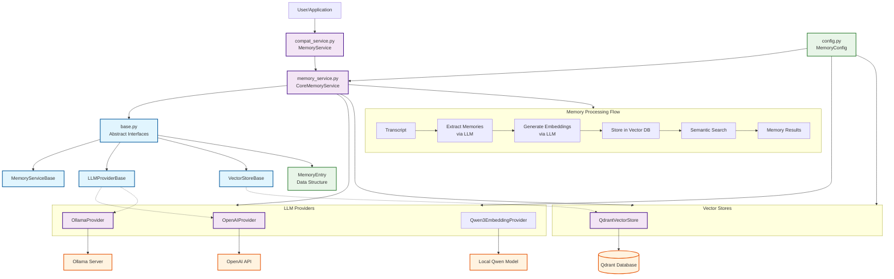
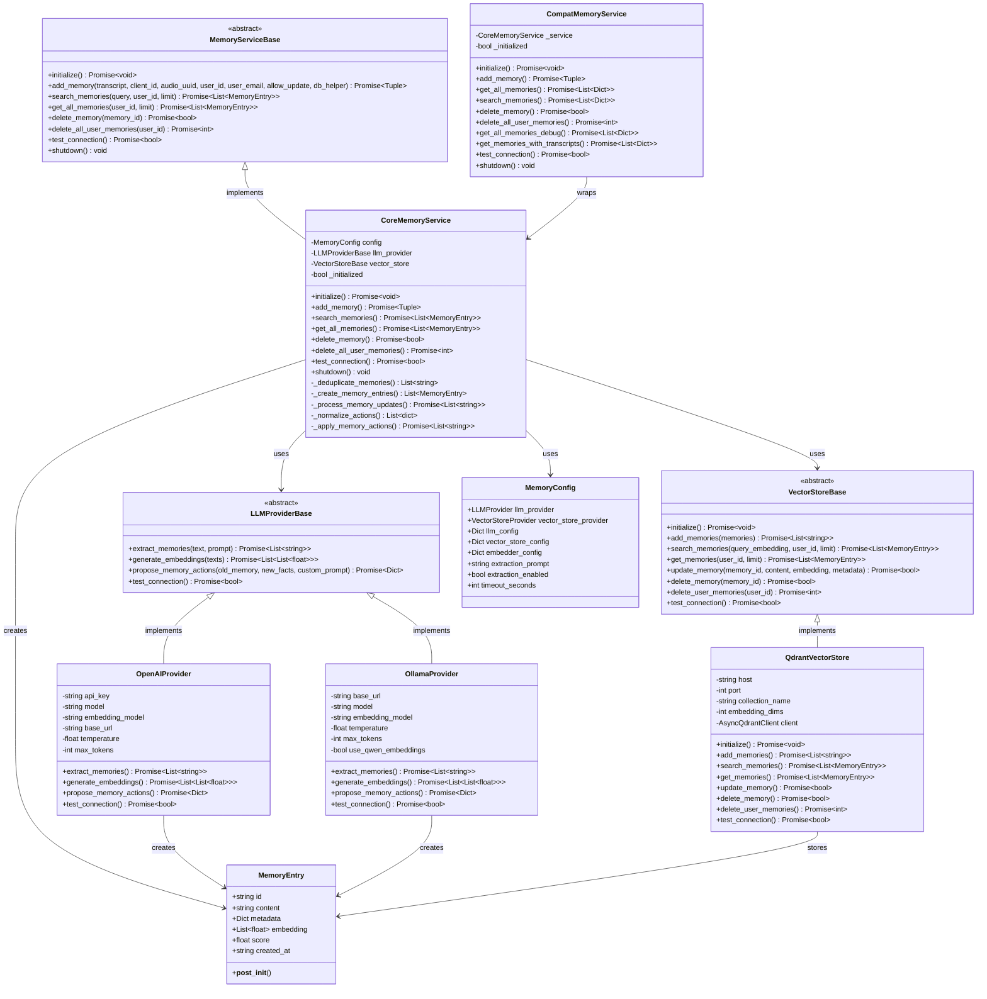
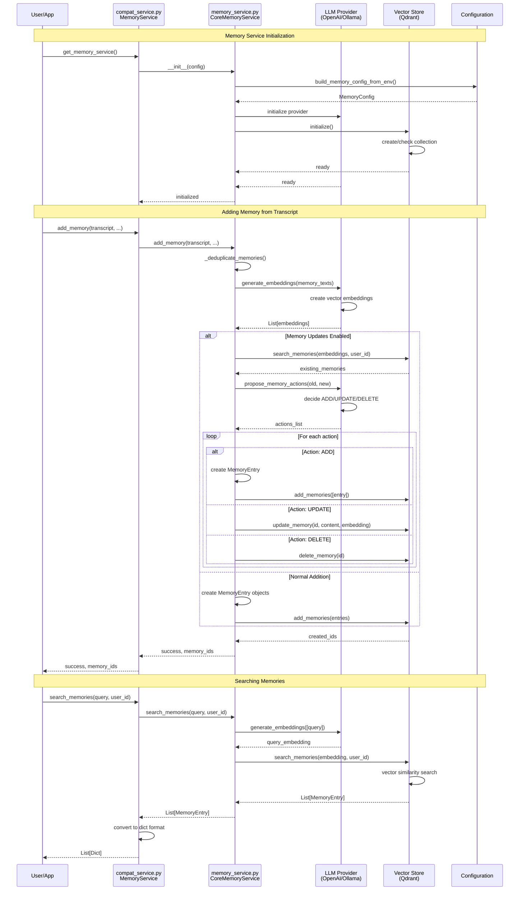

# Memory Service Architecture

This module provides a comprehensive memory management system for the Omi backend, supporting multiple LLM providers and vector stores for intelligent memory extraction, storage, and retrieval.

## Architecture Overview

The memory service is built with a clean, modular architecture that separates concerns and allows for easy extension:

```
memory/
├── base.py                  # Abstract base classes and interfaces
├── memory_service.py        # Core implementation
├── compat_service.py        # Backward compatibility wrapper
├── config.py               # Configuration management
├── utils.py                # Utility functions
├── prompts.py              # LLM prompts
├── providers/
│   ├── __init__.py
│   ├── llm_providers.py    # LLM provider implementations
│   ├── vector_stores.py    # Vector store implementations
│   └── qwen_embedding.py   # Qwen3 embedding provider
└── README.md               # This file
```

## System Architecture Diagram



## Class Diagram



## Memory Processing Flow



## Key Components

### Base Classes (`base.py`)

Defines the core abstractions:

- **`MemoryEntry`**: Data structure for memory entries with content, metadata, and embeddings
- **`MemoryServiceBase`**: Abstract interface for memory service implementations
- **`LLMProviderBase`**: Abstract interface for LLM providers
- **`VectorStoreBase`**: Abstract interface for vector stores

### Core Implementation (`memory_service.py`)

The main `MemoryService` class that orchestrates all memory operations:

- Memory extraction from transcripts using LLM providers
- Embedding generation and vector storage
- Semantic search and retrieval
- Intelligent memory updates using LLM-driven actions
- User-scoped memory management

### Compatibility Layer (`compat_service.py`)

Provides backward compatibility with the original mem0-based interface:

- Drop-in replacement for existing code
- Data format conversion between old and new formats
- Maintains all original method signatures
- Global service instance management

### Providers (`providers/`)

#### LLM Providers (`llm_providers.py`)

- **`OpenAIProvider`**: GPT models for memory extraction and embeddings
- **`OllamaProvider`**: Local models with optional Qwen3 embeddings

#### Vector Stores (`vector_stores.py`)

- **`QdrantVectorStore`**: High-performance vector database for semantic search

## Usage Examples

### Basic Usage (Backward Compatible)

```python
from advanced_omi_backend.memory import get_memory_service

# Get the global service instance
memory_service = get_memory_service()
await memory_service.initialize()

# Add memories from transcript
success, memory_ids = await memory_service.add_memory(
    transcript="User discussed their goals for the next quarter.",
    client_id="client123",
    audio_uuid="audio456", 
    user_id="user789",
    user_email="user@example.com"
)

# Search memories
results = await memory_service.search_memories(
    query="quarterly goals",
    user_id="user789",
    limit=5
)

# Get all user memories
memories = await memory_service.get_all_memories("user789")
```

### Advanced Usage (New Architecture)

```python
from advanced_omi_backend.memory import CoreMemoryService
from advanced_omi_backend.memory.config import build_memory_config_from_env

# Create service with explicit configuration
config = build_memory_config_from_env()
service = CoreMemoryService(config)
await service.initialize()

# Use with memory updates enabled
success, memory_ids = await service.add_memory(
    transcript="My favorite destination is now Tokyo instead of Paris.",
    client_id="client123",
    audio_uuid="audio456",
    user_id="user789", 
    user_email="user@example.com",
    allow_update=True  # Enable intelligent memory updates
)
```

### Custom Provider Implementation

```python
from advanced_omi_backend.memory.base import LLMProviderBase

class CustomLLMProvider(LLMProviderBase):
    async def extract_memories(self, text: str, prompt: str) -> List[str]:
        # Custom implementation
        pass
    
    async def generate_embeddings(self, texts: List[str]) -> List[List[float]]:
        # Custom implementation  
        pass
    
    # ... implement other abstract methods
```

## Configuration

### Environment Variables

The service can be configured using environment variables:

```bash
# LLM Provider Configuration
LLM_PROVIDER=openai  # or 'ollama'
OPENAI_API_KEY=your_openai_key
OPENAI_BASE_URL=https://api.openai.com/v1
OLLAMA_BASE_URL=http://localhost:11434

# Vector Store Configuration  
VECTOR_STORE_PROVIDER=qdrant
QDRANT_BASE_URL=localhost
QDRANT_PORT=6333
QDRANT_COLLECTION_NAME=omi_memories

# Memory Service Settings
MEMORY_EXTRACTION_ENABLED=true
MEMORY_TIMEOUT_SECONDS=30
```

### Configuration Objects

```python
from advanced_omi_backend.memory.config import (
    MemoryConfig,
    create_openai_config, 
    create_qdrant_config
)

# Create configuration programmatically
config = MemoryConfig(
    llm_provider=LLMProvider.OPENAI,
    llm_config=create_openai_config(
        api_key="your_key",
        model="gpt-4"
    ),
    vector_store_provider=VectorStoreProvider.QDRANT,
    vector_store_config=create_qdrant_config(
        host="localhost",
        port=6333
    ),
    extraction_enabled=True,
    timeout_seconds=30
)
```

## Memory Update Intelligence

The service supports intelligent memory updates through LLM-driven action proposals:

### Action Types

- **ADD**: Create new memories for novel information
- **UPDATE**: Modify existing memories with new details
- **DELETE**: Remove outdated or incorrect memories  
- **NONE**: No action needed for redundant information

### Example Flow

1. User says: "My favorite color is blue"
   - **Action**: ADD new memory

2. Later, user says: "Actually, my favorite color is green now"
   - **Action**: UPDATE existing memory about favorite color

3. User says: "I love the color green" (redundant)
   - **Action**: NONE (no change needed)

## Testing and Debugging

### Service Information

```python
from advanced_omi_backend.memory import get_service_info

info = get_service_info()
print(info)
# {
#   "active_service": "new",
#   "new_service_available": True,
#   "legacy_service_available": True,
#   "base_classes_available": True,
#   "core_service_available": True
# }
```

### Connection Testing

```python
# Test all connections
success = await memory_service.test_connection()
print(f"Service healthy: {success}")
```

### Debug Memory Data

```python
# Get all memories across users (admin function)
debug_memories = await memory_service.get_all_memories_debug(limit=50)

# Get memories with source transcripts
enriched = await memory_service.get_memories_with_transcripts("user123")
```

## Migration from Legacy Service

The new architecture maintains full backward compatibility. To migrate:

1. **No code changes needed** - existing code continues to work
2. **Enable new service** by setting `USE_NEW_MEMORY_SERVICE=true`
3. **Optional**: Use new features like intelligent updates
4. **Optional**: Migrate to new configuration format

### Migration Helper

```python
from advanced_omi_backend.memory import migrate_from_mem0

# Migrate existing mem0 data (if applicable)
await migrate_from_mem0()
```

## Performance Considerations

### Memory Updates

- Standard mode: Fast, simple memory addition
- Update mode: Slower but intelligent, prevents duplicates

### Embedding Quality

- OpenAI embeddings: High quality, API cost
- Ollama + Qwen3: Good quality, local/free
- Ollama native: Basic quality, fully local

### Vector Store

- Qdrant: Production-ready, high performance
- Collection auto-created with cosine similarity
- User-scoped filtering for data isolation

## Error Handling

The service includes comprehensive error handling:

- **Initialization failures**: Graceful fallback to legacy service
- **LLM timeouts**: Configurable timeout with fallback strategies
- **Vector store errors**: Detailed logging and error recovery
- **Invalid data**: Input validation and sanitization

## Extensibility

The modular architecture makes it easy to:

1. **Add new LLM providers**: Inherit from `LLMProviderBase`
2. **Add new vector stores**: Inherit from `VectorStoreBase`  
3. **Customize memory logic**: Override `MemoryServiceBase` methods
4. **Add new data formats**: Extend `MemoryEntry` or conversion logic

## Security Considerations

- **User isolation**: All memories are scoped by user_id
- **Input sanitization**: Text inputs are validated and cleaned
- **API key management**: Secure handling of provider credentials
- **Access control**: Database relationships track memory ownership

## Monitoring and Logging

The service provides detailed logging at multiple levels:

```python
import logging

# Configure memory service logging
logging.getLogger("memory_service").setLevel(logging.INFO)
```

Log levels:
- **INFO**: Service lifecycle, major operations
- **DEBUG**: Detailed processing information  
- **WARNING**: Recoverable errors, fallbacks
- **ERROR**: Serious errors requiring attention

## Troubleshooting

### Common Issues

1. **Import errors**: Check environment variables and dependencies
2. **Connection failures**: Verify provider URLs and credentials
3. **Embedding errors**: Check model availability and API limits
4. **Memory not found**: Verify user_id scoping and filters

### Debug Mode

Enable detailed logging for troubleshooting:

```bash
export PYTHONPATH=/path/to/backend
export LOG_LEVEL=DEBUG
```

## Frequently Asked Questions (FAQ)

### 🔄 **Changing LLM Providers**

#### Q: How do I change from OpenAI to Ollama or llama.cpp?

**A:** You can change LLM providers in several ways:

**Option 1: Environment Variables (Recommended)**
```bash
# Switch to Ollama
export LLM_PROVIDER=ollama
export OLLAMA_BASE_URL=http://localhost:11434
export OLLAMA_MODEL=llama2

# Switch to llama.cpp (via Ollama)
export LLM_PROVIDER=ollama
export OLLAMA_BASE_URL=http://localhost:11434
export OLLAMA_MODEL=llama2:7b
```

**Option 2: Code Configuration**
```python
from advanced_omi_backend.memory.config import (
    MemoryConfig, LLMProvider, create_ollama_config
)

config = MemoryConfig(
    llm_provider=LLMProvider.OLLAMA,
    llm_config=create_ollama_config(
        base_url="http://localhost:11434",
        model="llama2:7b",
        embedding_model="nomic-embed-text"
    ),
    # ... other config
)
```

**Files to modify:**
- **Primary**: `config.py` - Update provider selection logic
- **Secondary**: `providers/llm_providers.py` - Add new provider implementation
- **Tertiary**: `base.py` - Extend LLMProviderBase if needed

#### Q: How do I add a completely new LLM provider (e.g., Anthropic, Cohere)?

**A:** Create a new provider class in `providers/llm_providers.py`:

```python
from ..base import LLMProviderBase

class AnthropicProvider(LLMProviderBase):
    def __init__(self, config: Dict[str, Any]):
        self.api_key = config["api_key"]
        self.model = config.get("model", "claude-3-sonnet")
    
    async def extract_memories(self, text: str, prompt: str) -> List[str]:
        # Implement using Anthropic API
        pass
    
    async def generate_embeddings(self, texts: List[str]) -> List[List[float]]:
        # Implement using Anthropic embeddings
        pass
    
    # ... implement other abstract methods
```

Then update `config.py` to support the new provider.

---

### 🎯 **Changing Prompts and Extraction Logic**

#### Q: How do I change the fact extraction prompt?

**A:** Modify the prompts in `prompts.py`:

**File to change:** `prompts.py`

```python
# Update the default fact retrieval prompt
FACT_RETRIEVAL_PROMPT = """Your custom prompt here...
Extract meaningful facts from the following text:
{text}

Return as JSON:
{
    "facts": ["fact1", "fact2"],
    "preferences": ["pref1", "pref2"]
}"""
```

**Alternative: Environment Variable Override**
```bash
export MEMORY_EXTRACTION_PROMPT="Your custom prompt here..."
```

#### Q: How do I change the memory update prompt (ADD/UPDATE/DELETE logic)?

**A:** Modify the update memory prompt in `prompts.py`:

**File to change:** `prompts.py`

```python
DEFAULT_UPDATE_MEMORY_PROMPT = """You are a smart memory manager...
Your custom logic for deciding when to ADD, UPDATE, or DELETE memories.

Given existing memories and new facts, decide actions:
- ADD: for completely new information
- UPDATE: when information changes/contradicts
- DELETE: when information becomes outdated
- NONE: when no action is needed
"""
```

**Custom prompt per call:**
```python
await memory_service.add_memory(
    transcript="...",
    # ... other params
    custom_prompt="Your specific prompt for this transcript"
)
```

---

### 🗄️ **Changing Vector Database**

#### Q: How do I change from Qdrant to Pinecone, Weaviate, or another vector DB?

**A:** Create a new vector store implementation in `providers/vector_stores.py`:

**File to change:** `providers/vector_stores.py`

```python
from ..base import VectorStoreBase, MemoryEntry

class PineconeVectorStore(VectorStoreBase):
    def __init__(self, config: Dict[str, Any]):
        self.api_key = config["api_key"]
        self.environment = config["environment"]
        self.index_name = config["index_name"]
    
    async def initialize(self) -> None:
        # Initialize Pinecone client
        pass
    
    async def add_memories(self, memories: List[MemoryEntry]) -> List[str]:
        # Add to Pinecone index
        pass
    
    # ... implement other abstract methods
```

**Update configuration in `config.py`:**
```python
class VectorStoreProvider(Enum):
    QDRANT = "qdrant"
    PINECONE = "pinecone"  # Add new provider
    WEAVIATE = "weaviate"  # Add new provider

def create_pinecone_config(api_key: str, environment: str, index_name: str):
    return {
        "api_key": api_key,
        "environment": environment,
        "index_name": index_name
    }
```

**Environment variable usage:**
```bash
export VECTOR_STORE_PROVIDER=pinecone
export PINECONE_API_KEY=your_key
export PINECONE_ENVIRONMENT=us-west1-gcp
export PINECONE_INDEX_NAME=memories
```

---

### ⚙️ **Advanced Customization**

#### Q: How do I add custom memory processing logic?

**A:** Extend the core memory service in `memory_service.py`:

**File to change:** `memory_service.py`

```python
class CustomMemoryService(CoreMemoryService):
    async def add_memory(self, transcript: str, **kwargs):
        # Pre-process transcript
        processed_transcript = await self._custom_preprocessing(transcript)
        
        # Call parent method
        return await super().add_memory(processed_transcript, **kwargs)
    
    async def _custom_preprocessing(self, transcript: str) -> str:
        # Your custom logic here
        return transcript
```

#### Q: How do I change the embedding model or dimensions?

**A:** Update configuration in `config.py`:

**File to change:** `config.py`

```python
# For OpenAI
export OPENAI_EMBEDDER_MODEL=text-embedding-3-large  # 3072 dimensions

# For custom dimensions
export QDRANT_EMBEDDING_DIMS=3072
```

---

### 🔧 **Troubleshooting Customizations**

#### Q: My custom provider isn't working. What should I check?

**A:** Verify these points:

1. **Inheritance**: Ensure your class inherits from the correct base class
2. **Abstract Methods**: Implement ALL abstract methods from the base class
3. **Configuration**: Update both provider creation and enum values
4. **Import Paths**: Check that your new provider is properly imported
5. **Error Logs**: Look for initialization errors in the logs

#### Q: How do I test my custom provider?

**A:** Create a test script:

```python
from advanced_omi_backend.memory import CoreMemoryService
from advanced_omi_backend.memory.config import MemoryConfig

# Test your custom configuration
config = MemoryConfig(...)
service = CoreMemoryService(config)

# Test initialization
await service.initialize()

# Test basic operations
success = await service.test_connection()
print(f"Connection: {success}")
```

---

## Contributing

When contributing to the memory service:

1. **Follow the abstractions**: Inherit from base classes
2. **Add comprehensive tests**: Cover error cases and edge conditions
3. **Update documentation**: Keep README and docstrings current
4. **Maintain compatibility**: Ensure backward compatibility
5. **Add type hints**: Use proper typing throughout

## Future Enhancements

Planned improvements:

- Additional vector store backends (Pinecone, Weaviate)
- More LLM providers (Anthropic, Cohere)
- Advanced memory summarization
- Multi-modal memory support (images, audio)
- Memory compression and archival
- Real-time memory streaming