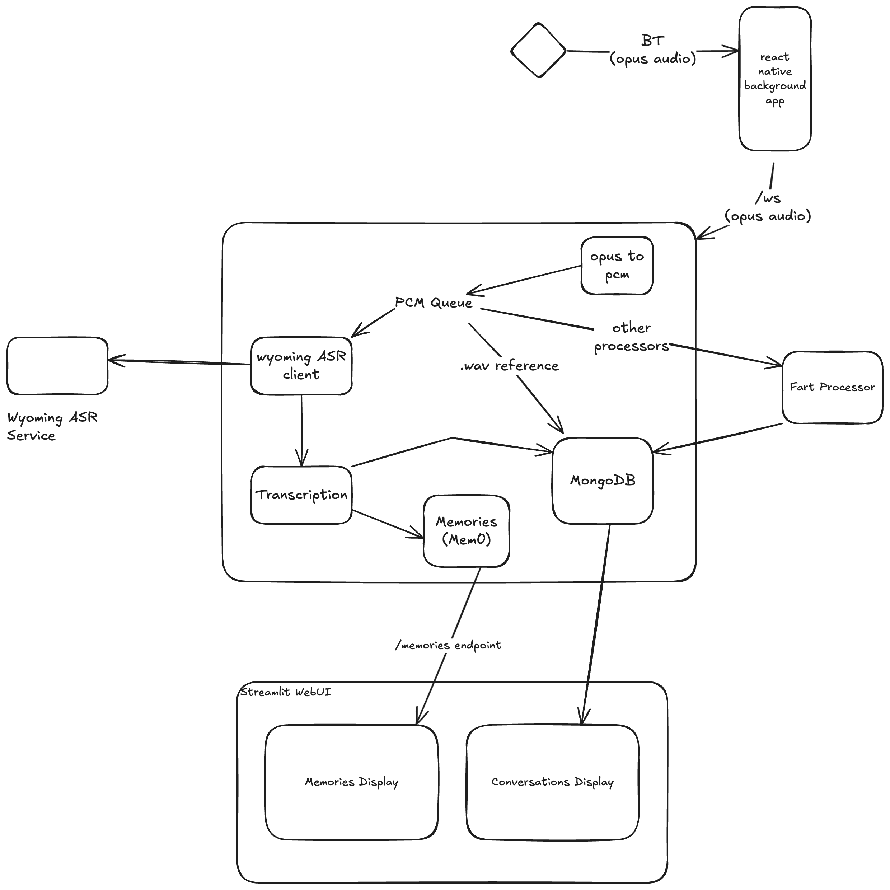

# Friend-Lite Features & Architecture

## Core Features

Friend-Lite supports AI-powered personal systems through multiple OMI-compatible audio devices:

**Memory System:**
- **Advanced memory system** with pluggable providers (Friend-Lite native or OpenMemory MCP)
- **Memory extraction** from conversations with individual fact storage
- **Semantic memory search** with relevance threshold filtering and live results
- **Memory count display** with total count tracking from native providers
- **Speaker-based memory filtering** to control processing based on participant presence

**Audio Processing:**
- **Action item detection** and tracking  
- **Multi-device support** for comprehensive audio capture
- **Cross-client compatibility** (optional with OpenMemory MCP)

**Device Support:**
- OMI pendants and wearables
- Smart glasses with audio capture
- Any Bluetooth-enabled audio device

## Architecture Overview



DevKit2 streams audio via Bluetooth using OPUS codec. The processing pipeline includes:

**Audio Processing:**
- Bluetooth audio capture from OMI devices
- OPUS codec streaming to backend services
- WebSocket-based real-time audio transport

**Transcription Services:**
- Cloud-based: Deepgram API for high-quality transcription
- Self-hosted: Local ASR services (Parakeet, Moonshine)

**AI Processing:**
- LLM-based conversation analysis (OpenAI or local Ollama)
- **Dual memory system**: Friend-Lite native or OpenMemory MCP integration
- Enhanced memory extraction with individual fact storage
- **Semantic search** with relevance scoring and threshold filtering
- Smart deduplication and memory updates (ADD/UPDATE/DELETE)
- Action item detection

**Data Storage:**
- MongoDB: User data, conversations, and transcripts
- Qdrant: Vector storage for semantic memory search
- Audio files: Optional conversation recording

## Repository Structure

### 📱 Mobile App (`app/`)
- **React Native app** for connecting to OMI devices via Bluetooth
- Streams audio in OPUS format to selected backend
- Cross-platform (iOS/Android) support
- Uses React Native Bluetooth SDK

### 🖥️ Backends (`backends/`)

Choose one based on your needs:

#### **Simple Backend** (`backends/simple-backend/`)
**Use case:** Getting started, basic audio processing, learning

**Features:**
- ✅ Basic audio ingestion (OPUS → PCM → WAV chunks)
- ✅ File-based storage (30-second segments)
- ✅ Minimal dependencies
- ✅ Quick setup

**Requirements:**
- Minimal resource usage
- No external services

**Limitations:**
- No transcription
- No memory/conversation management
- No speaker recognition
- Manual file management

---

#### **Advanced Backend** (`backends/advanced/`) **RECOMMENDED**
**Use case:** Production use, full feature set

**Features:**
- Audio processing pipeline with real-time WebSocket support
- **Pluggable memory system**: Choose between Friend-Lite native or OpenMemory MCP
- Enhanced memory extraction with individual fact storage (no generic fallbacks)
- **Semantic memory search** with relevance threshold filtering and total count display
- **Speaker-based memory filtering**: Optional control over processing based on participant presence
- Smart memory updates with LLM-driven action proposals (ADD/UPDATE/DELETE)
- Speaker recognition and enrollment
- Action items extraction from conversations
- Audio cropping (removes silence, keeps speech)
- Conversation management with session timeouts
- Modern React web UI with live recording and advanced search
- Multiple ASR options (Deepgram API + offline ASR)
- MongoDB for structured data storage
- RESTful API for all operations
- **Cross-client compatibility** (with OpenMemory MCP provider)

**Requirements:**
- Multiple services (MongoDB, Qdrant, Ollama)
- Higher resource usage
- Authentication configuration

---

#### **OMI-Webhook-Compatible Backend** (`backends/omi-webhook-compatible/`)
**Use case:** Existing OMI users, migration from official OMI backend

**Features:**
- ✅ Compatible with official OMI app webhook system
- ✅ Drop-in replacement for OMI backend
- ✅ Audio file storage
- ✅ ngrok integration for public endpoints

**Requirements:**
- ngrok for public access

**Limitations:**
- Limited features compared to advanced backend
- No built-in AI features

---

#### **Example Satellite Backend** (`backends/example-satellite/`)
**Use case:** Distributed setups, external ASR integration

**Features:**
- ✅ Audio streaming satellite
- ✅ Streams audio to remote ASR servers
- ✅ Bluetooth OMI device discovery
- ✅ Integration with external voice processing systems

**Requirements:**
- Separate ASR server

**Limitations:**
- Limited standalone functionality

### 🔧 Additional Services (`extras/`)

#### **ASR Services** (`extras/asr-services/`)
- **Self-hosted** ASR services
- **Moonshine** - Fast offline ASR
- **Parakeet** - Alternative offline ASR
- Self-hosted transcription options

#### **Speaker Recognition Service** (`extras/speaker-recognition/`)
- Standalone speaker identification service
- Used by advanced backend
- REST API for speaker operations

#### **HAVPE Relay** (`extras/havpe-relay/`)
- Audio relay service
- Protocol bridging capabilities

## Audio Streaming Protocol

Backends and ASR services use standardized audio streaming:
- Consistent audio streaming format
- Interoperable with external systems
- Modular ASR service architecture
- Easy to swap ASR providers

## Deployment Scenarios

### Single Machine (Recommended for beginners)
1. **Clone the repository**
2. **Run interactive setup**: `uv run --with-requirements setup-requirements.txt python init.py`
3. **Start all services**: `python services.py start --all --build`
4. **Access WebUI**: `http://localhost:5173` for the React web dashboard

### Distributed Setup (Advanced users with multiple machines)
1. **GPU Machine**: Deploy LLM services (Ollama, ASR, Speaker Recognition)
   ```bash
   # Ollama with GPU
   docker run -d --gpus=all -p 11434:11434 ollama/ollama:latest
   
   # ASR services
   cd extras/asr-services && docker compose up moonshine -d
   
   # Speaker recognition
   cd extras/speaker-recognition && docker compose up --build -d
   ```

2. **Backend Machine**: Deploy lightweight services
   ```bash
   cd backends/advanced
   
   # Configure distributed services in .env
   OLLAMA_BASE_URL=http://[gpu-machine-tailscale-ip]:11434
   SPEAKER_SERVICE_URL=http://[gpu-machine-tailscale-ip]:8001
   
   docker compose up --build -d
   ```

3. **Tailscale Networking**: Connect machines securely
   ```bash
   # On each machine
   curl -fsSL https://tailscale.com/install.sh | sh
   sudo tailscale up
   ```

## Use Case Recommendations

### For Beginners
1. Start with **Simple Backend** to understand the basics
2. Use **mobile app** to connect your OMI device
3. Examine saved audio chunks in `./audio_chunks/`

### For Production Use
1. Use **Advanced Backend** for full features
2. Run the orchestrated setup: `uv run --with-requirements setup-requirements.txt python init.py`
3. Start all services: `python services.py start --all --build`
4. Access the Web UI at http://localhost:5173 for conversation management

### For OMI Users
1. Use **OMI-Webhook-Compatible Backend** for easy migration
2. Configure ngrok for public webhook access
3. Point your OMI app to the webhook URL

### For Home Assistant Users
1. Use **Example Satellite Backend** for audio streaming
2. Set up ASR services from `extras/asr-services/`
3. Configure external voice processing integration

### For Distributed/Self-Hosting Users
1. Use **Advanced Backend** for full feature set
2. **Separate GPU services**: Run LLM/ASR on dedicated GPU machine
3. **Lightweight backend**: Deploy FastAPI/WebUI on VPS or Raspberry Pi
4. **Tailscale networking**: Secure VPN connection between services (automatic CORS support)
5. **Service examples**: Ollama on GPU machine, backend on lightweight server

## Service Ports & Access

### Advanced Backend (Primary)

**HTTP Mode (Default):**
```
Web Dashboard: http://localhost:5173
Backend API:   http://localhost:8000
MongoDB:       localhost:27017
Qdrant:        localhost:6333 (HTTP), 6334 (gRPC)
```

**HTTPS Mode:**
```
Web Dashboard: https://localhost/ or https://your-ip/
Backend API:   https://localhost/api/ or https://your-ip/api/
(Internal services same as HTTP mode)
```

### Speaker Recognition Service

**HTTP Mode:**
```
Web UI:  http://localhost:5174
API:     http://localhost:8085
```

**HTTPS Mode (nginx proxy):**
```
Web UI:  https://localhost:8444/ or https://your-ip:8444/
API:     https://localhost:8444/api/
HTTP:    http://localhost:8081/ (redirects to HTTPS)
```

### Additional Services

```
Parakeet ASR:     http://localhost:8767
OpenMemory MCP:   http://localhost:8765 (API + WebUI)
```

**Note:** HTTPS mode requires SSL certificate setup. See individual service documentation for SSL configuration details.

For detailed port configuration, see [ports-and-access.md](ports-and-access.md).